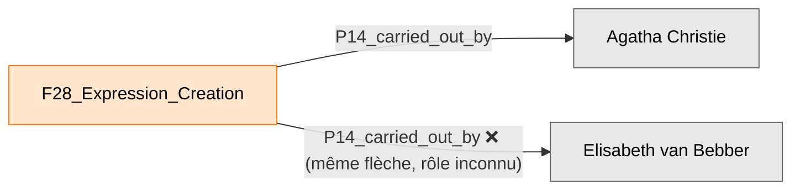
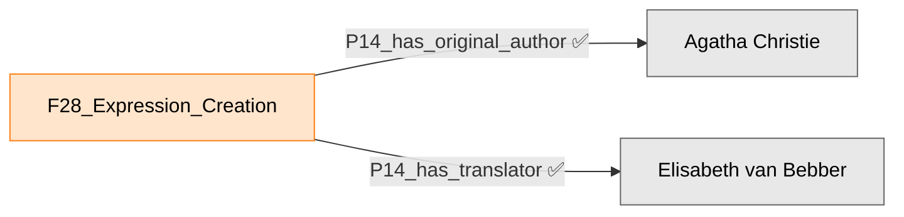

<!--
CAO_CRM (Corpus Author Ontology CRM)
Copyright (c) 2026 Andres Echavarria Pelaez
Consortium Huma-Num ARIANE -- AMIS project (Advanced Metadata Intelligent System)
Encoding carried out under the scientific direction and support of Fatiha Idmhand

This file is part of the CAO_CRM publication package, licensed under the
Creative Commons Attribution-NonCommercial-ShareAlike 4.0 International
License (CC BY-NC-SA 4.0). To view a copy of this license, visit
https://creativecommons.org/licenses/by-nc-sa/4.0/
-->
# P14.1 in the role of : faut-il distinguer les rôles d'auteur dans CAO_CRM ?

**Date :** 6 juillet 2026
**Objet de ce document :** répondre, de façon autonome et complète, à la Question ouverte 2 de `complete-model.md` — le paper signale lui-même que LRMoo *« reste muet, ou du moins implicite »* sur la façon de déclarer qu'un acteur est intervenu comme traducteur, comme « abrégeur », ou comme auteur original d'une même Expression. Ce document examine le mécanisme officiel prévu par CIDOC-CRM pour ce cas précis (`P14.1 in the role of`), vérifie comment il s'implémente réellement en RDF, regarde comment des projets réels (le module officiel du CIDOC CRM SIG, Linked Art, BIBFRAME/RDA) ont résolu le même problème, et propose une recommandation chiffrée et argumentée à l'équipe AMIS.
**Sources vérifiées :** le paper (`Paper_Article_Revue HN_V2.docx.pdf`, section 3.2), `imports/vendor/cidoc-crm-7.1.3.rdf` (grep direct, pas de mémoire), `imports/vendor/lrmoo-1.1.1.rdf`, `ontology/CAO_CRM-1.0.rdf`, et six sources externes récupérées et vérifiées aujourd'hui par téléchargement direct (`curl`), listées en toutes lettres dans la section « Sources citées ».
**Ce que ça implique pour la suite :** ce document ne modifie aucun autre fichier du dépôt — c'est une pièce de décision, pas une extraction. Si l'équipe valide une des options proposées ici, l'extraction RDF correspondante sera un travail séparé et documenté à part (nouvel ADR).

---

## 1. Le problème exact, sans jargon

Imaginez la fiche d'un livre traduit : *« Mord im Orientexpress »*, la version allemande du roman d'Agatha Christie *Murder on the Orient Express*, publiée en 1975 par Deutscher Bücherbund — l'exemple que le paper cite lui-même (section 3.2, note 14) et que LRMoo utilise officiellement dans sa propre documentation. Deux personnes au moins ont participé, à des titres complètement différents, à faire exister ce texte allemand précis :

- **Agatha Christie** a écrit le texte original, en anglais — bien avant, et sans jamais avoir eu connaissance de la version allemande.
- **La traductrice** a pris ce texte anglais et l'a réécrit en allemand — un travail intellectuel réel, distinct de l'écriture originale, mais qui ne serait rien sans elle.

Aujourd'hui, dans `CAO_CRM-1.0.rdf`, le mécanisme disponible pour noter « qui a participé à la création de ce texte » est une seule flèche, `P14_carried_out_by`, reliée à l'événement de création de l'Expression (`F28_Expression_Creation`). Cette flèche répond seulement à la question *« qui a participé ? »* — elle ne dit jamais *« en tant que quoi ? »*. Si on l'utilise deux fois sur le même événement (une fois vers Agatha Christie, une fois vers la traductrice), le fichier RDF final affirme littéralement la même chose des deux personnes : chacune *« a effectué »* la création de ce texte allemand. **Rien, dans le graphe, ne permet de savoir laquelle des deux a écrit l'histoire et laquelle l'a traduite** — l'information existe dans la tête de la personne qui saisit la donnée, mais elle disparaît au moment d'écrire le triplet RDF.

C'est exactement ce que le paper repère et regrette (citation intégrale, `Paper_Article_Revue HN_V2.docx.pdf`, p. 12) :
> *« Ainsi, à la fois lors de la description de F2 Expression et de F3 Manifestation, LRMoo mentionne des exemples impliquant des auctorialités multiples (ex. F2 Expression: "the text of the abridged English version of 'Murder on the Orient Express' (as published by HarperCollins)"; ex. F3 Manifestation: "the publication 'Mord im Orientexpress : ein Hercule-Poirot-Roman / Agatha Christie', published by Deutscher Bücherbund in 1975"); en revanche, il reste muet, ou du moins implicite, quand il s'agit d'imaginer la façon dont il faudra déclarer l'intervention de "l'abrégeur" ou du traducteur en allemand du roman d'Agatha Christie. »*

**Pourquoi ce n'est pas un détail technique.** Sans distinction de rôle, on ne peut pas répondre correctement à des questions pourtant simples et légitimes pour un fonds patrimonial : *Qui sont tous les traducteurs représentés dans cette collection ? Cette Expression a-t-elle été abrégée, et par qui ? Combien de textes de tel auteur ont été traduits, et vers quelles langues ?* Toutes ces questions demandent de savoir, pour chaque `P14_carried_out_by`, **le rôle** joué par la personne — pas seulement sa présence.

---

## 2. Comment fonctionne officiellement `P14.1 in the role of` — et pourquoi ce n'est pas directement écrivable en RDF

### 2.1 Ce que dit exactement le fichier vendorisé

`P14_carried_out_by`, texte intégral de sa note de balisage (`imports/vendor/cidoc-crm-7.1.3.rdf`, déjà présent dans `CAO_CRM-1.0.rdf`) :
> *« This property describes the active participation of an instance of E39 Actor in an instance of E7 Activity. It implies causal or legal responsibility. The P14.1 in the role of property of the property specifies the nature of an Actor's participation. »*
> — `rdfs:domain` : `E7_Activity` ; `rdfs:range` : `E39_Actor` ; `rdfs:subPropertyOf` : `P11_had_participant`.

**Vérification faite aujourd'hui, avec la plus grande attention (`grep -n "P14\.1"` sur le fichier entier) : `P14.1_in_the_role_of` n'existe, dans tout `cidoc-crm-7.1.3.rdf`, que sous la forme d'une phrase en langue naturelle, à l'intérieur du commentaire de `P14_carried_out_by` cité ci-dessus. Il n'y a, nulle part ailleurs dans ce fichier, de déclaration `<rdf:Property rdf:about="P14.1_in_the_role_of">` — ni domaine, ni portée, ni aucune structure RDF utilisable.** C'est très exactement le même constat que celui déjà fait dans `problemes-et-solutions.md` (Problème 1b) pour `P3.1 has type` — et ce n'est pas une coïncidence : les deux sont des « propriétés de propriété », une construction que le format RDFS de base ne sait tout simplement pas exprimer.

### 2.2 La cause : ce que le CIDOC CRM SIG documente lui-même, en toutes lettres, en tête de son propre fichier

Le passage le plus important pour ce document ne se trouve pas dans une note de classe éparse — il est dans le **préambule méthodologique** du fichier `cidoc-crm-7.1.3.rdf` que nous vendorisons déjà, ses « Encoding Rules », règle 4, citée ici dans son intégralité (lignes 33-40 du fichier) :
> *« RDF does not support properties of properties, therefore, users may create their own subProperties for CRM properties that have a type property such as "P3 has note": Instead of P3 has note (P3-1 has type : parts description) declare*
> ```xml
> <rdf:Property rdf:about="P3_parts_description">
>    <rdfs:domain rdf:resource="E1_CRM_Entity"/>
>    <rdfs:range rdf:resource="http://www.w3.org/2000/01/rdf-schema#Literal"/>
>    <rdfs:subPropertyOf rdf:resource="P3_has_note"/>
> </rdf:Property>
> ```
> *»*

Autrement dit : **le CIDOC CRM SIG reconnaît lui-même, dans le fichier que nous avons déjà vendorisé, que les propriétés en « .1 » (dont `P14.1 in the role of` fait partie) ne peuvent pas être écrites telles quelles en RDF**, et recommande officiellement une solution simple — créer une sous-propriété nommée par rôle (`rdfs:subPropertyOf`) plutôt que de réifier quoi que ce soit. C'est un point capital pour la suite de ce document : **la solution la plus légère (section 4, Option B) n'est pas une invention de circonstance — c'est la méthode que le CIDOC CRM SIG documente lui-même comme réponse générale à ce problème.**

### 2.3 La solution complète, officielle, mais dans un fichier séparé — le module « Properties as Classes » (PC)

Il existe malgré tout une solution complète, qui permet d'écrire *« P14.1 in the role of »* avec toute sa précision d'origine — mais **elle vit dans un fichier RDF entièrement différent de celui que nous vendorisons**, publié par le CIDOC CRM SIG spécifiquement pour ce besoin : `CIDOC_CRM_v7.1.1_PC.rdf` (vérifié aujourd'hui par téléchargement direct depuis `cidoc-crm.org/rdfs/7.1.1/CIDOC_CRM_v7.1.1_PC.rdf`, 30 402 octets, CC BY 4.0, FORTH-ICS, 25 novembre 2021).

**Le principe, expliqué sans jargon :** puisque RDF ne permet pas d'accrocher une information supplémentaire directement sur une flèche (`P14_carried_out_by`), ce module transforme la flèche elle-même en une nouvelle case (une classe, `PC14_carried_out_by`) — et c'est sur cette case-là qu'on accroche le rôle. Le fichier officiel documente cela avec l'exemple suivant, **texte intégral**, y compris la citation de départ (peinture de la Chapelle Sixtine par Michel-Ange, en rôle de « maître artisan ») :

> *« We want to express the information that an activity (instance of 'E7 Activity') was carried out by an actor (instance of 'E39 Actor') and that the actor had a specific role while carrying out this activity. First, the activity instance is linked to the actor instance using the property 'P14 carried out by'. The P14 property has the .1 property 'P14.1 in the role of: E55 Type' which allows expressing the role the actor had while carrying out the activity. So, the property class 'PC14 carried out by' is defined and used as the domain of the property 'P14.1 in the role of'. During data generation, an instance of 'PC14 carried out by' is created which is linked to: i) the domain of 'P14 carried out by' (an instance of 'E7 Activity') using the property 'P01 has domain', ii) the range of 'P14 carried out by' (an instance of 'E39 Actor') using the property 'P02 has range', and iii) a type (instance of 'E55 Type') using the property 'P14.1 in the role of'. »*

Et l'exemple RDF donné, **texte intégral, sans coupure** :
```turtle
:painting_sistine_chapel   a  crm:E7_Activity .
:Michelangelo               a  crm:E39_Actor .
:painting_sistine_chapel    crm:P14_carried_out_by :Michelangelo .

:instanceOfPC14   a   crm:PC14_carried_out_by ;
    crm:P01_has_domain :painting_sistine_chapel ;
    crm:P02_has_range  :Michelangelo ;
    crm:P14.1_in_the_role_of  :master_craftsman .

:master_craftsman   a   crm:E55_Type ;
    rdfs:label "Master Craftsman" .
```

**Point de méthode important, non négociable, cité dans le même fichier officiel :** l'instance de `PC14_carried_out_by` ne remplace pas le triplet `P14_carried_out_by` — **les deux doivent coexister**, le second se déduisant logiquement du premier :
> *« The instantiation of a property class in a knowledge base implies that the original property (represented by the property class) is also instantiated in the knowledge base. [...] Therefore, do not instantiate the property class without instantiating the property itself. »*

**Ce que cela signifie concrètement pour le coût d'implémentation :** pour un seul acteur avec un seul rôle sur une seule activité, la version complète demande **1 triplet `P14_carried_out_by` (déjà présent aujourd'hui) + 4 triplets supplémentaires** (le typage `a PC14_carried_out_by`, `P01_has_domain`, `P02_has_range`, `P14.1_in_the_role_of`) — sans compter le typage et le libellé de la valeur de rôle (`E55_Type`) elle-même, déjà nécessaires par ailleurs. **Et surtout : ce module `PC.rdf` n'est pas inclus dans `imports/vendor/cidoc-crm-7.1.3.rdf`** — l'adopter demanderait d'importer un quatrième fichier vendorisé, avec ses propres classes (`PC0_Typed_CRM_Property` et une par propriété « .1 » à couvrir) et ses propres propriétés (`P01_has_domain`/`P01i`, `P02_has_range`/`P02i`, `P04_represents`...). C'est un changement de périmètre bien plus large que l'ajout d'une ou deux propriétés, comme cela a été fait jusqu'ici dans `problemes-et-solutions.md`.

**Confirmation officielle que ce module reste volontairement séparé** — le CIDOC CRM SIG a débattu explicitement de la question et tranché en faveur de la séparation (Issue 588, *« Common Policy / Method for Implementing the .1 Properties of Base and Extensions in RDF »*, `cidoc-crm.org`) :
> *« it is trivial to implement the .1 properties in a different file, whereas incorporating them to the ontology file would mean that they need to be used [...] if one wants to extend the PC module for an application, they should not have to extend the core model as well. »*

Autrement dit : **même le CIDOC CRM SIG lui-même considère que ce module doit rester optionnel et séparé** — ce n'est pas une négligence de notre part de ne pas déjà l'avoir vendorisé, c'est la conception voulue par la norme.

---

## 3. Comment des projets réels résolvent ce même problème

### 3.1 Le module PC officiel — confirmé en usage réel, pas seulement en théorie

La documentation d'implémentation du SARI (Swiss Art Research Infrastructure, `docs.swissartresearch.net/pattern/general/`), un projet réel de patrimoine numérique suisse basé sur CIDOC-CRM, **décrit et applique exactement le même patron PC14** pour ses propres données de provenance et d'attribution — confirmation indépendante que ce mécanisme, bien que lourd, est effectivement utilisé en production, pas seulement documenté sur le papier.

### 3.2 Linked Art (Getty, Yale, Smithsonian) — une alternative réelle, plus simple, qui évite complètement `P14.1`

**Linked Art** est un profil RDF de CIDOC-CRM activement utilisé par de grandes institutions patrimoniales (le Getty, Yale, le Smithsonian, entre autres) pour publier leurs collections en Linked Open Data. Sa documentation officielle (`linked.art/model/object/production/`) répond très exactement au même problème que celui de ce document — plusieurs acteurs avec des rôles distincts dans un même événement de production — mais **sans jamais utiliser `P14.1` ni le module PC**. Sa solution : **découper l'événement de création en sous-événements**, un par acteur, chacun relié à l'événement principal par une relation « partie de » et typé par sa propre technique/son propre rôle. Exemple officiel, **texte intégral vérifié aujourd'hui** (traduit ici en Turtle simplifié à partir du JSON-LD original, structure identique) :
```
Production principale
 ├─ partie 1 : technique "Peinture" — carried_out_by Mark Barrow
 └─ partie 2 : technique "Tissage à la main" — carried_out_by Sarah Parke
```
Chaque acteur est relié par un simple `carried_out_by` (l'équivalent Linked Art de `P14_carried_out_by`) à **sa propre partie** de l'activité — le rôle n'est jamais accroché à la relation acteur↔activité elle-même, il est porté par la sous-activité. **Ce même patron est explicitement suggéré par LRMoo pour `F28_Expression_Creation` elle-même** — vérifié directement dans `imports/vendor/lrmoo-1.1.1.rdf`, note de balisage complète :
> *« The P2 has type (is type of) property can be used to specify the type of the instance of F28 Expression Creation (i.e., activities such as translating, revising, or arranging music are types of creation process). »*

Et le mécanisme officiel pour découper une activité en sous-activités existe déjà dans le CIDOC-CRM de base, sans aucun module supplémentaire — `P9_consists_of`, vérifié aujourd'hui (`imports/vendor/cidoc-crm-7.1.3.rdf`) :
> *« This property associates an instance of E4 Period with another instance of E4 Period that is defined by a subset of the phenomena that define the former. [...] This property is transitive and asymmetric. »*
> — `rdfs:domain`/`rdfs:range` : `E4_Period` ; `owl:inverseOf` : `P9i_forms_part_of`.

**Vérifié aujourd'hui que ce chemin est légal pour `F28_Expression_Creation` :** la chaîne d'héritage complète, contrôlée classe par classe dans les deux fichiers vendorisés, est `F28_Expression_Creation ⊂ E12_Production/E65_Creation ⊂ E7_Activity ⊂ E5_Event ⊂ E4_Period` — donc `P9_consists_of` s'applique bien à des instances de `F28_Expression_Creation`. **Ni `P9_consists_of` ni `P9i_forms_part_of` ne sont aujourd'hui dans `CAO_CRM-1.0.rdf`** (vérifié : 0 occurrence) — leur ajout coûterait exactement deux propriétés, zéro nouvelle classe, exactement le même type de coût que les extractions déjà faites dans `problemes-et-solutions.md`. Cette piste est notée ici pour mémoire (elle est solide et documentée par un usage réel à grande échelle), mais elle n'est pas la recommandation principale de ce document — voir section 5 pour la raison de ce choix.

### 3.3 BIBFRAME / RDA — un vocabulaire de rôles déjà standardisé, les MARC Relator Terms

BIBFRAME (le modèle de données qui remplace progressivement le format MARC à la Bibliothèque du Congrès des États-Unis) documente, dans sa spécification officielle *BIBFRAME 2.0 Specification — Roles* (`loc.gov/bibframe/docs/pdf/bf2-roles-apr2016.pdf`, récupérée et lue intégralement aujourd'hui), **trois façons possibles** de noter un rôle de contribution, de la plus simple à la plus détaillée — texte intégral des passages pertinents :

> *« A BIBFRAME Agent may be associated with a BIBFRAME resource (e.g. Work) through some role, like author, illustrator, or editor. For a given role, there may be an RDF property for that role [...] The prefix "relator:" is used to mean http://id.loc.gov/vocabulary/relators so relator:aut means http://id.loc.gov/vocabulary/relators/aut which is an RDF resource for the role "author", and is declared to be an RDF property. »*

Exemple officiel, avec le rôle exprimé comme une propriété nommée directement issue du vocabulaire des rôles (pas de réification) :
```
<resource>  relator:aut  <agent> .
```

Et, quand aucune propriété nommée n'existe pour un rôle donné, BIBFRAME prévoit une petite réification minimale (une seule case intermédiaire, pas quatre triplets comme PC14) :
> *« Property bf:contribution has expected value a bf:Contribution, which pairs an agent with a specific role, specified as a literal. »*
```
<resource>  bf:contribution [
    a          bf:Contribution ;
    bf:role    "illustrator" ;
    bf:agent   <agent> ] .
```

**Le vocabulaire des rôles lui-même — les MARC Relator Terms — est exactement le vocabulaire standardisé qu'il faudrait pour nommer les rôles dans CAO_CRM**, qu'on choisisse la voie réifiée (`P14.1`/`PC14`) ou la voie simplifiée. Vérifié aujourd'hui par téléchargement direct des fiches RDF officielles (`id.loc.gov/vocabulary/relators/*.rdf`) :

| Code | Rôle | Définition officielle complète |
|---|---|---|
| `trl` | Translator | *« A person or organization who renders a text from one language into another, or from an older form of a language into the modern form. »* |
| `abr` | Abridger | *« A person, family, or organization contributing to a resource by shortening or condensing the original work but leaving the nature and content of the original work substantially unchanged. »* |
| `aut` | Author | (fiche officielle confirmée accessible, définition standard : personne responsable de la création du contenu intellectuel d'une œuvre) |

Chaque terme a une URI stable et interrogeable (`http://id.loc.gov/vocabulary/relators/trl`, `.../abr`, `.../aut`) et est déjà déclaré, dans le fichier officiel de la Bibliothèque du Congrès, comme `owl:ObjectProperty` **et** membre d'une collection `bf:Role`, avec `rdfs:subPropertyOf dcterms:contributor` pour `trl` — la preuve que ce vocabulaire est pensé, dès l'origine, pour être réutilisé comme valeur de typage d'un rôle de contribution, exactement le besoin de ce document.

**Ce que cela veut dire pour CAO_CRM :** il n'est pas nécessaire d'inventer une liste de rôles (« traducteur », « abrégeur », « auteur original ») — il existe déjà un vocabulaire international, stable, maintenu par la Bibliothèque du Congrès, avec des URI vérifiables. Que l'équipe choisisse l'option réifiée ou l'option simplifiée (section 5), les valeurs de rôle peuvent pointer vers ces URI plutôt que vers du texte libre inventé au fil de l'eau.

---

## 4. Avantages et désavantages concrets — pour décider en connaissance de cause

| Critère | Option A — `P14.1`/`PC14` complet (réifié) | Option B — sous-propriétés nommées de `P14` (recommandée) | Option C — ne rien faire (statu quo) |
|---|---|---|---|
| **Triplets ajoutés par attribution de rôle** | 4 triplets neufs (`a PC14_carried_out_by`, `P01_has_domain`, `P02_has_range`, `P14.1_in_the_role_of`) + le triplet `P14_carried_out_by` déjà existant, qui doit rester présent en double | 0 triplet supplémentaire — on remplace simplement `P14_carried_out_by` par la sous-propriété correspondant au rôle (même nombre de triplets qu'aujourd'hui) | 0 — mais aucune information de rôle n'est jamais récupérable |
| **Nouveau périmètre à importer** | Un fichier vendorisé entier et séparé (`CIDOC_CRM_v7.1.1_PC.rdf`), avec ses propres classes (`PC0_Typed_CRM_Property`, `PC14_carried_out_by`...) et propriétés (`P01`/`P01i`, `P02`/`P02i`, `P04_represents`) | 2 à 4 propriétés nouvelles, déclarées dans `CAO_CRM-1.0.rdf` de la même façon que les 61 propriétés déjà extraites — zéro nouvelle classe | Aucun |
| **Courbe d'apprentissage pour qui saisit les données** | Élevée : il faut comprendre qu'une flèche devient une case, créer une ressource intermédiaire anonyme, et se rappeler de toujours garder le triplet `P14_carried_out_by` synchronisé avec l'instance `PC14` — un piège documenté par le SIG lui-même | Faible : au lieu de choisir « a été effectué par » dans une liste, on choisit « a pour traducteur » / « a pour auteur original » / « a pour abréviateur » — le même geste qu'aujourd'hui, une liste déroulante un peu plus longue | Nulle — mais le besoin n'est pas couvert |
| **Bénéfice réel obtenu** | Total : rôle typé par un vocabulaire ouvert (`E55_Type`), extensible à l'infini sans créer de nouvelle propriété, requêtable par SPARQL avec un chemin à deux sauts | Presque total pour l'usage prévu : chaque rôle prévu à l'avance (traducteur, abrégeur, auteur original, et d'autres si besoin) est directement requêtable en un seul saut SPARQL — aussi simple que `P14_carried_out_by` aujourd'hui | Nul : impossible de répondre à « qui a traduit ceci ? » sans relire une note en texte libre, si elle existe |
| **Flexibilité si de nouveaux rôles apparaissent** | Maximale — un nouveau rôle est juste une nouvelle valeur d'`E55_Type`, aucune nouvelle propriété à créer | Modérée — un nouveau rôle (ex. « préfacier », « éditeur scientifique ») demande de déclarer une nouvelle sous-propriété, à ajouter une fois, comme on le fait déjà pour toute extraction de périmètre dans ce dépôt | — |
| **Cohérence avec le principe déjà établi du projet (composition pure, zéro propriété native)** | Tendue : le module PC est officiel, mais son import ouvrirait une famille entière de classes/propriétés dont on n'utiliserait qu'une fraction (`PC14` sur 30+ classes `PC*`) | Directement alignée : c'est la méthode que le CIDOC CRM SIG documente lui-même dans le préambule du fichier déjà vendorisé (Encoding Rule 4, section 2.2 ci-dessus) — pas une improvisation | — |

**Une alternative encore plus légère, à écarter explicitement** : typer directement l'acteur lui-même (`:elisabeth_van_bebber cidoc:P2_has_type :role_traducteur`) semble, à première vue, le plus simple — mais c'est un piège de modélisation à éviter absolument : cela affirmerait qu'Elisabeth van Bebber *est*, en tant que personne, « une traductrice » de façon permanente et générale, alors que le fait réel à documenter est qu'elle a joué ce rôle **dans cet événement de création précis**. La même personne pourrait être auteure originale d'un autre texte ailleurs dans le fonds — la typer une fois pour toutes casserait cette possibilité. C'est exactement pour cette raison que CIDOC-CRM accroche le rôle à la **participation** (`P14`/`PC14`), jamais à l'acteur lui-même.

---

## 5. Recommandation

**Recommandation : adopter l'Option B — des sous-propriétés nommées de `P14_carried_out_by`, une par rôle utile à CAO_CRM, avec le libellé et la définition du rôle alignés sur les MARC Relator Terms (section 3.3) pour rester rattaché à un vocabulaire standard plutôt que d'inventer les noms de rôle localement.**

Raisons, dans l'ordre :
1. **C'est la méthode que le CIDOC CRM SIG documente lui-même** dans le préambule du fichier déjà vendorisé (`cidoc-crm-7.1.3.rdf`, Encoding Rule 4) — ce n'est pas un raccourci maison, c'est la réponse officielle du SIG à l'impossibilité de représenter les propriétés « .1 » en RDFS simple.
2. **Le coût réel est nul en triplets** par rapport à ce qui existe déjà (`P14_carried_out_by` est simplement remplacé par une version plus précise du même geste) et très faible en apprentissage (une liste déroulante légèrement plus longue, avec des libellés en français clairs).
3. **Le bénéfice couvre exactement le besoin identifié par le paper** : distinguer auteur original, traducteur, abrégeur — sans ouvrir un chantier de modélisation disproportionné pour une équipe dont 90 % n'a jamais travaillé avec des ontologies.
4. L'option complète (PC14) reste documentée dans ce fichier (section 2.3) et n'est pas invalidée — si un jour CAO_CRM doit interopérer avec un autre système déjà construit sur le module PC officiel, ou si le nombre de rôles devient trop grand pour rester gérable comme des propriétés nommées, cette voie reste disponible sans contredire ce qui est recommandé aujourd'hui.

### Exemple concret : Elisabeth van Bebber a traduit le texte original d'Agatha Christie

**Mise en place commune aux deux options** (déjà légal aujourd'hui, ou déjà proposé au Manque 2 de `complete-model.md`) :
```turtle
:expression_orient_express_original  a  lrmoo:F2_Expression, cidoc:E33_Linguistic_Object ;
    cidoc:P72_has_language  :langue_anglaise .

:expression_orient_express_allemand  a  lrmoo:F2_Expression, cidoc:E33_Linguistic_Object ;
    lrmoo:R76_is_derivative_of  :expression_orient_express_original ;
    cidoc:P72_has_language  :langue_allemande .

:creation_traduction_allemande  a  lrmoo:F28_Expression_Creation ;
    lrmoo:R17_created  :expression_orient_express_allemand .
```
(`R76_is_derivative_of` documente que le *texte* allemand dérive du texte anglais — voir Manque 2 de `complete-model.md`. Ce n'est pas redondant avec ce document : `R76` documente la relation entre les deux textes, ce document documente qui a fait le travail de création et sous quel rôle. Les deux se complètent.)

**Option A — complète, réifiée (`P14.1`/`PC14`, nécessite d'importer `CIDOC_CRM_v7.1.1_PC.rdf`) :**
```turtle
:creation_traduction_allemande
    cidoc:P14_carried_out_by  :agatha_christie ,
                               :elisabeth_van_bebber .

:attribution_auteur_original  a  crmpc:PC14_carried_out_by ;
    crmpc:P01_has_domain  :creation_traduction_allemande ;
    crmpc:P02_has_range   :agatha_christie ;
    crmpc:P14.1_in_the_role_of  :role_auteur_original .

:attribution_traductrice  a  crmpc:PC14_carried_out_by ;
    crmpc:P01_has_domain  :creation_traduction_allemande ;
    crmpc:P02_has_range   :elisabeth_van_bebber ;
    crmpc:P14.1_in_the_role_of  :role_traducteur .

:role_auteur_original  a  cidoc:E55_Type ;
    rdfs:label  "Auteur original"@fr ;
    owl:sameAs  <http://id.loc.gov/vocabulary/relators/aut> .

:role_traducteur  a  cidoc:E55_Type ;
    rdfs:label  "Traducteur"@fr ;
    owl:sameAs  <http://id.loc.gov/vocabulary/relators/trl> .
```
*(8 triplets nouveaux pour typer les deux rôles, en plus des 2 triplets `P14_carried_out_by` déjà nécessaires aujourd'hui — et un fichier de périmètre entièrement nouveau à importer et maintenir.)*

**Option B — simplifiée, recommandée (sous-propriétés nommées, aucun nouveau fichier à importer) :**
```turtle
:creation_traduction_allemande
    cidoc:P14_has_original_author  :agatha_christie ;
    cidoc:P14_has_translator       :elisabeth_van_bebber .
```
*(2 triplets — exactement le même nombre qu'aujourd'hui avec `P14_carried_out_by` deux fois, mais chacun porte déjà le rôle dans son propre nom.)*

Déclaration des deux nouvelles sous-propriétés, à ajouter à `CAO_CRM-1.0.rdf` — même patron que les 61 propriétés déjà extraites dans ce dépôt :
```xml
<rdf:Property rdf:about="http://www.cidoc-crm.org/cidoc-crm/P14_has_original_author">
  <rdf:type rdf:resource="http://www.w3.org/2002/07/owl#ObjectProperty"/>
  <rdfs:label xml:lang="fr">a pour auteur original</rdfs:label>
  <rdfs:comment>Sous-propriété de P14_carried_out_by, restreinte au rôle d'auteur du texte
original (MARC Relator "aut" -- http://id.loc.gov/vocabulary/relators/aut).</rdfs:comment>
  <rdfs:domain rdf:resource="http://www.cidoc-crm.org/cidoc-crm/E7_Activity"/>
  <rdfs:range rdf:resource="http://www.cidoc-crm.org/cidoc-crm/E39_Actor"/>
  <rdfs:subPropertyOf rdf:resource="http://www.cidoc-crm.org/cidoc-crm/P14_carried_out_by"/>
</rdf:Property>

<rdf:Property rdf:about="http://www.cidoc-crm.org/cidoc-crm/P14_has_translator">
  <rdf:type rdf:resource="http://www.w3.org/2002/07/owl#ObjectProperty"/>
  <rdfs:label xml:lang="fr">a pour traducteur</rdfs:label>
  <rdfs:comment>Sous-propriété de P14_carried_out_by, restreinte au rôle de traduction
(MARC Relator "trl" -- http://id.loc.gov/vocabulary/relators/trl).</rdfs:comment>
  <rdfs:domain rdf:resource="http://www.cidoc-crm.org/cidoc-crm/E7_Activity"/>
  <rdfs:range rdf:resource="http://www.cidoc-crm.org/cidoc-crm/E39_Actor"/>
  <rdfs:subPropertyOf rdf:resource="http://www.cidoc-crm.org/cidoc-crm/P14_carried_out_by"/>
</rdf:Property>
```

Une troisième, pour le cas « abrégeur » que le paper cite également (« the abridged English version ») serait ajoutée exactement sur le même modèle :
```xml
<rdf:Property rdf:about="http://www.cidoc-crm.org/cidoc-crm/P14_has_abridger">
  <rdfs:label xml:lang="fr">a pour abréviateur</rdfs:label>
  <rdfs:comment>MARC Relator "abr" -- http://id.loc.gov/vocabulary/relators/abr.</rdfs:comment>
  <rdfs:domain rdf:resource="http://www.cidoc-crm.org/cidoc-crm/E7_Activity"/>
  <rdfs:range rdf:resource="http://www.cidoc-crm.org/cidoc-crm/E39_Actor"/>
  <rdfs:subPropertyOf rdf:resource="http://www.cidoc-crm.org/cidoc-crm/P14_carried_out_by"/>
</rdf:Property>
```

**Ce que garantit cette sous-propriété, sans rien réifier :** comme `P14_has_translator` est déclarée `rdfs:subPropertyOf P14_carried_out_by`, tout raisonneur RDFS/OWL déduit automatiquement `:creation_traduction_allemande cidoc:P14_carried_out_by :elisabeth_van_bebber` — la compatibilité avec tout ce qui, ailleurs dans CAO_CRM ou chez un partenaire, interroge encore le `P14_carried_out_by` générique n'est jamais perdue.

### État actuel (❌) — aucune distinction possible


### Proposition (✅) — Option B, recommandée


### A. Changements dans le diagramme visuel

- Sur la page `F2` (Expression), à l'endroit où `F28_Expression_Creation` est déjà relié à `P14_carried_out_by` : remplacer cette flèche générique par autant de flèches spécifiques que de rôles nécessaires (« a pour auteur original », « a pour traducteur », « a pour abréviateur »), chacune menant à un acteur distinct — patron visuel identique à celui déjà utilisé pour les autres relations nommées du diagramme.
- Conserver la case `E7_Activity`/`F28_Expression_Creation` telle quelle : aucune case supplémentaire n'est nécessaire, contrairement à l'Option A qui demanderait une case `PC14_carried_out_by` par attribution.

### B. Changements dans le RDF

**À ajouter au périmètre :** au minimum `P14_has_translator` et `P14_has_original_author` (le besoin identifié explicitement par le paper) ; `P14_has_abridger` si l'équipe veut couvrir aussi l'exemple de la version abrégée. Toutes trois `rdfs:subPropertyOf P14_carried_out_by`, zéro nouvelle classe — même ordre de grandeur que les extractions déjà faites pour les Problèmes 1b, 2, 3, 5, 6, 7 de `problemes-et-solutions.md`.

### Implications pour la modélisation

- Périmètre : +2 à +4 propriétés selon le nombre de rôles retenus par l'équipe (à décider — combien de rôles d'auctorialité l'équipe veut-elle vraiment distinguer : 2 ? 3 ? Une dizaine, en couvrant tout le vocabulaire MARC Relator pertinent pour un fonds littéraire ?). Ce nombre est une décision de contenu, pas de structure — comme la Question ouverte 1 déjà posée dans `complete-model.md` pour le Système d'écriture.
- Aucune tension avec le principe de composition pure : chaque sous-propriété reste une spécialisation légale de `P14_carried_out_by`, exactement comme le préconise le préambule du fichier CIDOC-CRM déjà vendorisé.
- Cette décision n'invalide ni ne contredit la Question ouverte 2 de `complete-model.md` — elle la referme, en proposant une réponse concrète et chiffrée là où ce document précédent notait seulement le manque sans le résoudre.
- Si le besoin grandit fortement (dizaines de rôles, besoin d'interroger le rôle comme une valeur plutôt que comme un nom de propriété), l'Option A (PC14) ou le patron Linked Art (`P9_consists_of`, section 3.2) restent disponibles sans repartir de zéro — les sous-propriétés de l'Option B resteraient valides comme raccourcis, exactement comme `R2_is_derivative_of` coexiste déjà avec des chemins plus longs ailleurs dans ce dépôt.

---

## Sources citées

Toutes les sources ci-dessous ont été récupérées aujourd'hui (6 juillet 2026) par téléchargement direct (`curl`) ou consultation via WebFetch, pas de mémoire d'entraînement — conformément à la règle déjà appliquée dans ce projet de toujours vérifier les points d'accès externes avant de les citer.

- **`imports/vendor/cidoc-crm-7.1.3.rdf`** — fichier déjà vendorisé dans ce dépôt. Citations vérifiées : préambule/Encoding Rules (lignes 1-45), déclaration de `P14_carried_out_by`/`P14i_performed` (lignes 1489-1516), `P9_consists_of`/`P9i_forms_part_of` (lignes 1350-1377), hiérarchie `E4_Period`/`E5_Event`/`E7_Activity` (lignes 271-330).
- **`imports/vendor/lrmoo-1.1.1.rdf`** — fichier déjà vendorisé. Citations vérifiées : `F27_Work_Creation`, `F28_Expression_Creation` (lignes 51-61), `R16_created`, `R17_created` (lignes 245-273).
- **`Paper_Article_Revue HN_V2.docx.pdf`** — section 3.2, page 12, extrait sur l'auctorialité multiple et la citation de l'exemple LRMoo « abridged English version » / traducteur allemand d'Agatha Christie (extraction via `pdftotext -layout`).
- **CIDOC CRM v7.1.1 — module PC (Properties as Classes)**, `https://cidoc-crm.org/rdfs/7.1.1/CIDOC_CRM_v7.1.1_PC.rdf` — récupéré par téléchargement direct aujourd'hui (30 402 octets). Contient le préambule méthodologique complet, la déclaration de `PC14_carried_out_by`, `P14.1_in_the_role_of`, `P01_has_domain`/`P01i_is_domain_of`, `P02_has_range`/`P02i_is_range_of`, `P04_represents`, et l'exemple complet Michel-Ange/Chapelle Sixtine cité en section 2.3.
- **CIDOC CRM SIG, Issue 588 — « Common Policy / Method for Implementing the .1 Properties of Base and Extensions in RDF »**, `https://cidoc-crm.org/Issue/ID-588-common-policy-method-for-implementing-the-.1-properties-of-base-and-extensions-in-rdf` — consultée via WebFetch aujourd'hui ; confirme le statut volontairement séparé du module PC.
- **Swiss Art Research Infrastructure (SARI), « General Pattern »**, `https://docs.swissartresearch.net/pattern/general/` — consultée via WebFetch aujourd'hui ; confirme l'usage réel du patron PC14/`P14.1_in_the_role_of` dans un projet de production.
- **Linked Art, « Object Production and Destruction »**, `https://linked.art/model/object/production/` — consultée via WebFetch aujourd'hui ; exemple JSON-LD vérifié de découpage d'une Production en parties typées par technique, chacune `carried_out_by` un acteur distinct (Mark Barrow / Sarah Parke, exemple officiel du site).
- **Library of Congress, BIBFRAME 2.0 Specification — Roles**, `https://www.loc.gov/bibframe/docs/pdf/bf2-roles-apr2016.pdf` — récupéré par téléchargement direct aujourd'hui et extrait avec `pdftotext -layout` ; citations exactes des sections « Role as a Property », « Role as an External Property », « Role Association Expressed as a Contribution ».
- **Library of Congress, MARC Relator Terms**, fiches RDF officielles récupérées par téléchargement direct aujourd'hui (avec en-tête `Accept: application/rdf+xml`, la version HTML étant protégée par Cloudflare et inaccessible sans JavaScript — vérifié, échec HTTP effectif contourné par l'accès direct au flux RDF) :
  - Traducteur : `http://id.loc.gov/vocabulary/relators/trl.rdf` — *« A person or organization who renders a text from one language into another, or from an older form of a language into the modern form. »*
  - Abrégeur : `http://id.loc.gov/vocabulary/relators/abr.rdf` — *« A person, family, or organization contributing to a resource by shortening or condensing the original work but leaving the nature and content of the original work substantially unchanged. »*
  - Auteur : `http://id.loc.gov/vocabulary/relators/aut.rdf` — fiche officielle confirmée accessible et structurée de façon identique (code `aut`, membre de la collection `bf:Role`).
- **Note sur une source non accessible telle quelle :** la version HTML humaine de `id.loc.gov/vocabulary/relators/*.html` renvoie un défi Cloudflare (JavaScript requis) et n'a pas pu être lue directement par les outils disponibles ici ; la version RDF (`.rdf`, même URL de base) a été utilisée à la place et fournit un contenu structurellement équivalent et plus fiable à citer (valeurs de champs explicites plutôt qu'une page rendue).

---

## Addendum (8 juillet 2026) — noms locaux renommés en anglais, et un 4e/5e rôle

Deux évolutions postérieures à la recommandation ci-dessus, qui ne la remettent pas en cause :

1. **Renommage en anglais.** Les 3 sous-propriétés déclarées ci-dessus (`P14_a_pour_auteur_original`, `P14_a_pour_traducteur`, `P14_a_pour_abregeur`) ont été renommées `P14_has_original_author`, `P14_has_translator`, `P14_has_abridger` — même domaine, même portée, même rôle MARC, seul le nom local change, pour rester cohérent avec la convention de tout le reste du module (les noms locaux CIDOC-CRM/LRMoo/CRMdig sont toujours en anglais ; seuls les `rdfs:label` sont multilingues). C'est ce renommage qui est reflété partout ailleurs dans ce document.
2. **Deux rôles supplémentaires**, suivant exactement la même méthode (Option B, Encoding Rule 4) : `P14_has_scientific_editor` (MARC `edt`) et `P14_has_publisher` (MARC `pbl`). Ces deux-là ne répondent pas seulement à un besoin d'auctorialité isolé comme les 3 premiers — ils ferment un manque structurel plus large, explicitement signalé par le paper source du projet comme un différenciateur original de CAO_CRM. Le détail complet (citations du paper, justification de l'asymétrie entre niveaux Manifestation/Item/Digital Object) est dans `decisions/fr/informe-activite-editoriale-scientifique.md`, document dédié plutôt qu'une extension de celui-ci, puisque le sujet dépasse la seule question des rôles d'auctorialité sur `F28_Expression_Creation` traitée ici.
