<!--
CAO_CRM (Corpus Author Ontology CRM)
Copyright (c) 2026 Andres Echavarria Pelaez
Consortium Huma-Num ARIANE -- AMIS project (Advanced Metadata Intelligent System)
Encoding carried out under the scientific direction and support of Fatiha Idmhand

This file is part of the CAO_CRM publication package, licensed under the
Creative Commons Attribution-NonCommercial-ShareAlike 4.0 International
License (CC BY-NC-SA 4.0). To view a copy of this license, visit
https://creativecommons.org/licenses/by-nc-sa/4.0/
-->
# Problèmes et solutions : les huit cas, un par un, dans l'ordre

**Date :** 6 juillet 2026
**Objet de ce document :** reprendre les huit relations non conformes du diagramme de Mélanie (`CRM_V8.json`), une par une, toujours dans le même ordre : (1) ce que le graphe affirme *réellement* — vérifié arête par arête dans le fichier JSON lui-même, jamais reconstitué de mémoire, (2) pourquoi c'est incorrect — avec citation officielle, (3) ce qu'il faut changer, (4) comment on l'implémente — **en séparant explicitement ce qui change dans le diagramme visuel (JSON) de ce qui change dans le RDF (code)**, ce sont deux personnes différentes qui exécutent chacun de ces deux types de changement, (5) ce que ça implique pour la modélisation. **Les coquilles/erreurs de frappe du diagramme ne sont pas reprises ici** — déjà signalées à part aux responsables du diagramme. Ce document ne traite que des problèmes de fond.

---

## Table des huit problèmes

| # | Le graphe de Mélanie affirme | Domaine/portée officiels exigés | Nature du problème |
|---|---|---|---|
| 1 | Trois arêtes convergent sur chaque case `E62_String` — `P3_has_note`, `P2_has_type` (depuis un `E55_Type`), et une arête sans étiquette — identique pour « Description » et « Système d'écriture » | — | `E62_String` n'a pas d'URI ; les deux caractéristiques ont une structure identique mais un besoin opposé (texte libre vs catégorie) |
| 1b | (suite du 1) — distinguer plusieurs catégories qui partagent toutes `E55_Type`/`P2_has_type` | `E55_Type` → `E55_Type` (`P127_has_broader_term`) | `P127_has_broader_term`, cité dans la note d'`E55_Type`, jamais déclarée dans le module |
| 2 | `E56_Language --P150_defines_typical_parts_of--> E90_Symbolic_Object`, posé sur `F3_Manifestation` | `E55_Type` → `E55_Type` ; officiellement à l'Expression, pas la Manifestation | Détournement de la propriété **et** mauvais niveau (Manifestation au lieu d'Expression, `LRM-E3-A6`) |
| 3 | `E3_Condition_State --P7_took_place_at--> E53_Place` | `E4_Period` → `E53_Place` | `E3_Condition_State` n'est pas une sous-classe d'`E4_Period` **et** révèle un vrai manque : `F5_Item` n'a de localisation nulle part dans le diagramme (`P54`/`P55` manquants) |
| 4 | `P104_is_subject_to` posée sur 7 classes (4 légales dont `F5_Item`, découvert en vérifiant les 9 pages ; 3 illégales : `F1_Work`/`E7_Activity`/`D2_Digitization_Process`) | `E72_Legal_Object` → `E30_Right` | Incompatibilité catégorielle, probablement due à un copier-coller lors de la construction du diagramme |
| 5 | `E12_Production --R27_materialized--> F3_Manifestation` | `F32_Item_Production_Event` → `F3_Manifestation` | Domaine trop général (classe mère au lieu de la sous-classe exigée) |
| 6 | `D1_Digital_Object --L61_contains_value_set_of--> E54_Dimension` | `D9_Data_Object` → `E54_Dimension` | Même schéma que le problème 5 |
| *(complément)* | Une case « D2-A » fait passer `D2_Digitization_Process` par `F3_Manifestation` via une arête brisée | `L1_digitized` exige `E18_Physical_Thing`, jamais `F3_Manifestation` | Distinction voulue par l'équipe (confirmé au paper) entre numérisation et production native — mais implémentée avec la mauvaise classe ; corrigé par `D7_Digital_Machine_Event`, pas en supprimant la branche |
| 7 | `E54_Dimension --P90_has_value--> E60_Number`, et `P91_has_unit` totalement absente | `P90_has_value` → `rdfs:Literal` (pas `E60_Number`) ; `P91_has_unit` → `E58_Measurement_Unit` | `E60_Number` est un Primitive Value sans URI (même défaut que `E62_String`) ; l'unité de mesure manque entièrement |
| 8 | `P82`/`P82a`/`P82b`/`P90` déclarées `rdfs:Literal`, contre `xsd:dateTime`/`xsd:integer` dans l'original de Mélanie | Norme officielle : `rdfs:Literal` ; original de Mélanie : XSD précis | Précision perdue, sans faute — la reconstruction suit la norme officielle au mot près, plus permissive que ce que Mélanie avait ajouté |

---

## Problème 1 — « Description » et « Système d'écriture » : trois arêtes réelles, pas une

**Correction importante (vérifiée le 6 juillet 2026) :** l'analyse initiale de ce problème ne montrait qu'une seule arête (`E55_Type --P2_has_type--> E62_String`). En retraçant chaque arête individuellement dans le fichier `CRM_V8.json` (et pas seulement les arêtes portant une étiquette « Propriété(iPropriété) »), il apparaît que la case `E62_String` de « Description » et celle de « Système d'écriture » reçoivent chacune **trois arêtes indépendantes**, pas une seule — et ce, de façon strictement identique pour les deux cas.

### Ce que le graphe affirme réellement

```
F5_Item / D1_Digital_Object  --P3_has_note-->  E62_String   (« Description » ou « Système d'écriture »)
E55_Type (« Type de description »/« Type de système »)  --P2_has_type-->  [la même case E62_String]
E55_Type (« Type de description »/« Type de système »)  --(aucune étiquette)-->  xsd:string
```

Vérifié par lecture directe du JSON, case par case, pour les deux caractéristiques — la structure des trois arêtes est rigoureusement identique dans les deux cas. Le diagramme ne fait, structurellement, **aucune différence** entre « Description » et « Système d'écriture » — la différence entre les deux vient uniquement du sens réel de chacune, pas de leur représentation graphique.

### Pourquoi c'est incorrect — avec documentation

1. `E62_String` n'a pas d'URI (voir Problème 1, citation déjà établie : *« All Primitive Values become rdfs:Literal [...] E62 String [...] were not defined in RDFS »*) — les deux arêtes qui y aboutissent sont donc, telles quelles, irréalisables.
2. La troisième arête, sans étiquette, vers `xsd:string`, ne correspond à aucune propriété nommée — vraisemblablement une note visuelle jamais finalisée par l'auteur du diagramme, pas une relation à conserver.
3. **Le vrai motif derrière les deux premières arêtes (`P3_has_note` et `P2_has_type`) n'est pas une redondance gratuite.** La note de balisage officielle de `P3_has_note` (`cidoc-crm-7.1.3.rdf`) mentionne explicitement une sous-propriété destinée à qualifier une note : *« The **P3.1 has type** property of P3 has note allows differentiation of specific notes, e.g. "construction", "decoration", etc. »* — le diagramme semble avoir voulu exprimer cette qualification, mais en dessinant deux arêtes de haut niveau au lieu de réifier correctement la relation.
4. **Vérifié aujourd'hui, directement dans le document officiel LRMoo v1.0** (`LRMoo_V1.0.pdf`, section 8.2, tableau des attributs) — deux lignes distinctes qui tranchent la question pour chacun des deux besoins :

   | Attribut LRM | Modélisation officielle |
   |---|---|
   | `LRM-E1-A2` Res → **Note** : *"Any kind of information about a res that..."* | `E1 CRM Entity. P3 has note: E62 String` |
   | `LRM-E9-A8` Nomen → **Script** : *"The script in which the nomen string is..."* | `F12 Nomen. P2 has type: E55 Type {Script}` |

   Autrement dit, **la note officielle utilise `P3_has_note` pour "Note", et `P2_has_type`/`E55_Type` pour "Script" — jamais l'inverse, et jamais les deux à la fois.**

**Réserve à formuler honnêtement à l'équipe :** `LRM-E9-A8` définit l'attribut « Script » pour `F12_Nomen` (une entité LRMoo qui représente une désignation/un nom), pas directement pour `F5_Item`/`D1_Digital_Object`. `F12_Nomen` n'est pas dans notre périmètre de 29 classes. Appliquer ce même mécanisme (`P2_has_type`/`E55_Type`) directement à l'objet physique/numérique est une **extension par analogie** du patron officiel — cohérente dans son principe, mais pas une correspondance exacte au cas d'usage officiel.

### Ce qu'il faut changer — et pourquoi ce n'est PAS le même changement dans les deux cas

| | Description | Système d'écriture |
|---|---|---|
| Arête à garder | `P3_has_note` | `P2_has_type` → `E55_Type` |
| Arête à supprimer | `P2_has_type` → `E55_Type` → `E62_String` | `P3_has_note` |
| Arête sans étiquette vers `xsd:string` | à supprimer | à supprimer |

**Ce point mérite d'être souligné : appliquer la même simplification aux deux cas serait une erreur.** Ce n'est pas parce que la structure du diagramme est identique dans les deux cas que la solution l'est aussi — c'est même l'inverse pour chacune des deux arêtes.

---

### A. Changements à faire dans le diagramme visuel (`CRM_V8.json`)

*Cette partie concerne l'équipe qui édite le diagramme draw.io — pas le fichier `.rdf`.*

**Pour « Description » :**
- Supprimer l'arête `E55_Type ("Type de description") --P2_has_type--> E62_String`.
- Supprimer la case `E55_Type ("Type de description")` elle-même, si elle ne sert à rien d'autre.
- Supprimer l'arête sans étiquette vers `xsd:string`.
- Garder uniquement `F5_Item / D1_Digital_Object --P3_has_note--> [case texte libre]`.

**Pour « Système d'écriture » :**
- Supprimer l'arête `F5_Item / D1_Digital_Object --P3_has_note--> E62_String`.
- Supprimer la case `E62_String` elle-même (plus aucune arête ne devrait y mener).
- Supprimer l'arête sans étiquette vers `xsd:string`.
- Garder `F5_Item / D1_Digital_Object --P2_has_type--> E55_Type`, et ajouter, si l'équipe valide le Problème 1b ci-dessous, une arête `E55_Type --P127_has_broader_term--> [case ancre « Système d'écriture »]`.

### B. Changements à faire dans le RDF (`ontology/CAO_CRM-1.0.rdf` et données)

*Cette partie concerne la personne qui encode l'ontologie/les données — pas le diagramme.*

**Pour « Description » — rien à ajouter au schéma, déjà tout présent :**
```xml
<rdf:Description rdf:about="http://www.cidoc-crm.org/cidoc-crm/P3_has_note">
    <rdf:type rdf:resource="http://www.w3.org/2002/07/owl#DatatypeProperty"/>
    <rdfs:domain rdf:resource="http://www.cidoc-crm.org/cidoc-crm/E1_CRM_Entity"/>
    <rdfs:range rdf:resource="http://www.w3.org/2000/01/rdf-schema#Literal"/>
</rdf:Description>
```
Donnée réelle à écrire :
```turtle
:item_le_rouge_et_le_noir  cidoc:P3_has_note  "document issu de la numérisation opérée par Gallica"@fr .
```

**Pour « Système d'écriture » — voir Problème 1b, qui détaille l'ajout nécessaire (`P127_has_broader_term`) au périmètre.**

### État actuel du graphe (❌ — identique pour les deux caractéristiques)
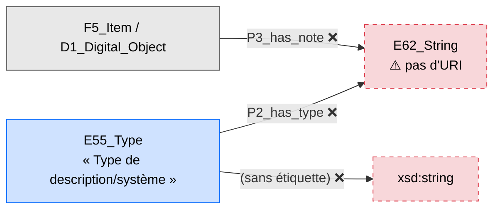

### Proposition (✅ — deux résolutions opposées, une par caractéristique)

> ⚠️ **Ce diagramme est dépassé pour la partie « Système d'écriture »** — voir la « Mise à jour du 6 juillet 2026 » plus bas dans cette même section : la case `Item2 -- P2_has_type --> V` ci-dessous ne représente plus la résolution retenue. « Système d'écriture » a été déplacé vers `F2_Expression` (co-typée `E33_Linguistic_Object`), pas gardé sur `F5_Item`/`D1_Digital_Object`. Seule la partie « Description » (`P3_has_note`) de ce diagramme reste valide telle quelle.

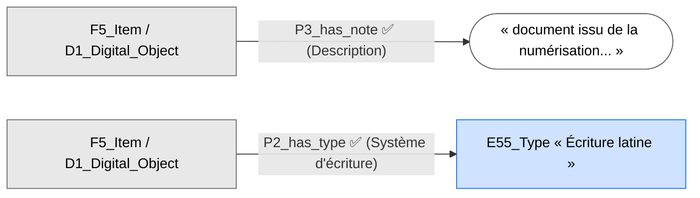
> ⚠️ **Rappel :** la branche « Système d'écriture » de ce diagramme est superseded — voir « Mise à jour du 6 juillet 2026 » ci-dessous pour la résolution correcte (déplacement vers `F2_Expression`).

### Implications pour la modélisation
- « Description » : simplification pure, aucune tension, la qualification perdue (« P3.1 has type ») est un choix assumé de simplicité plutôt qu'une reconstitution complète par réification.
- « Système d'écriture » : **mise à jour du 6 juillet 2026, voir ci-dessous — la résolution correcte n'est plus de le garder sur `F5_Item`/`D1_Digital_Object`, mais de le déplacer vers `F2_Expression`.**
- Le fait que le diagramme traite les deux caractéristiques de façon structurellement identique, alors qu'elles se résolvent de façon opposée, est le signe qu'il a été construit par un patron mécanique répété (copier-coller d'un modèle générique) plutôt que réfléchi caractéristique par caractéristique — utile à signaler à l'équipe qui édite le diagramme pour la suite.

### Mise à jour du 6 juillet 2026 — « Système d'écriture » doit vivre sur `F2_Expression`, pas sur `F5_Item`/`D1_Digital_Object`

**Cette section corrige les schémas ci-dessus (lignes « Système d'écriture »), et ferme la question ouverte correspondante de `complete-model.md`.** Une recherche approfondie a été menée après la publication de `complete-model.md`, avec vérification directe de chaque citation — le détail complet et les sources sont dans `complete-model.md`, section 4.

**Ce qui change :** le mécanisme reste identique (`P2_has_type` → `E55_Type`, ancré par `P127_has_broader_term`) — seul l'endroit où on l'accroche change, de `F5_Item`/`D1_Digital_Object` vers `F2_Expression` (co-typée `E33_Linguistic_Object`, exactement la même case déjà utilisée pour la Langue au Problème 2).

**Pourquoi ce déplacement, avec les citations qui le prouvent :**

1. `E34_Inscription`, la seule classe officielle CIDOC-CRM qui documente explicitement « l'alphabet utilisé », texte intégral (`imports/vendor/cidoc-crm-7.1.3.rdf`, vérifié directement) :
   > *« The transcription of the text can be documented in a note by P3 has note: E62 String. **The alphabet used can be documented by P2 has type: E55 Type.** »*
   > — `rdfs:subClassOf` : `E33_Linguistic_Object` (vérifié).

   C'est très exactement la même classe (`E33_Linguistic_Object`) que celle qui porte déjà la Langue sur `F2_Expression` depuis le Problème 2. La norme documente elle-même « l'alphabet utilisé » sur cette branche de classes précise — jamais sur `F5_Item` ni `D1_Digital_Object`.

2. La pratique bibliothéconomique réelle (MARC21) confirme ce jumelage : le champ 546 loge, dans le même champ, la langue (sous-champ `$a`) et l'écriture (sous-champ `$b`) — les deux sont traités depuis des décennies comme deux facettes d'un même fait, portées ensemble.

3. `LRM-E9-A8` (Script), l'unique attribut officiel « Script » du modèle IFLA LRM complet (103 pages parcourues intégralement, pas seulement la table), reste ancré sur `F12_Nomen` (un nom/désignation) — pas sur notre besoin réel (le texte lui-même). Ce n'était donc, dès le départ, ni la bonne classe sur `F5_Item`/`D1_Digital_Object`, ni celle qu'on pensait devoir imiter par analogie.

**Ce que cela répare, exactement :** le « doublon » que le paper lui-même signalait (*« [non renseigné, doublon] »*, tableau de métadonnées, ligne Objet numérique) n'était pas un vrai besoin de saisir deux fois la même donnée — c'était le signe que l'attribut vivait au mauvais niveau depuis le départ, exactement le même diagnostic que celui déjà posé pour la Langue.

**Le cas exceptionnel, réel mais rare, où un doublon reste légitime :** si le support concret affiche une écriture *différente* de celle de son Expression nominale (par exemple un fichier numérique translittéré), documenter le Système d'écriture directement sur `D1_Digital_Object`/`F5_Item` en plus reste possible — ce n'est alors plus un doublon machinal, mais une exception documentée avec une raison identifiable (voir `complete-model.md`, section 4.3, pour le détail).

#### A. Changement dans le diagramme visuel
- Retirer la case « Système d'écriture » de `F5_Item` et de `D1_Digital_Object`.
- L'ajouter sur la page `F2` (Expression), à côté de la Langue déjà présente (Problème 2) : une case `E55_Type` (ancrée par `P127_has_broader_term` vers l'ancre « Système d'écriture » déjà prévue), reliée à `F2_Expression` par `P2_has_type`.

#### B. Changement dans le RDF
Aucun ajout de périmètre — `E33_Linguistic_Object`, `P2_has_type`, `E55_Type`, `P127_has_broader_term` sont déjà tous extraits dans `CAO_CRM-1.0.rdf`.
```turtle
:expression_le_rouge_et_le_noir  a lrmoo:F2_Expression, cidoc:E33_Linguistic_Object ;
                                   cidoc:P72_has_language  :langue_francaise ;
                                   cidoc:P2_has_type  :valeur_ecriture_latine .

:valeur_ecriture_latine  a cidoc:E55_Type ;
                          rdfs:label "Écriture latine"@fr ;
                          cidoc:P127_has_broader_term  vocab:systeme-ecriture .
```

**Correction requise dans le paper** (même correction que pour la Langue, Problème 2) : déplacer la ligne « Système d'écriture » de « Objet physique »/« Objet numérique » vers la nouvelle ligne « Expression » du tableau de métadonnées.

---

## Problème 1b — Le problème général des « Types répétés », et sa solution complète (`P127_has_broader_term`)

*(Suite directe du Problème 1 ci-dessus. Cette section ne se limite plus à « Système d'écriture » seul — elle traite le problème dans sa forme générale, car il touche, en réalité, la totalité des caractéristiques de CAO_CRM qui passent par `P2_has_type`/`E55_Type`.)*

### 1. Les citations officielles complètes, sans coupure

**`E55_Type` (`imports/vendor/cidoc-crm-7.1.3.rdf`), texte intégral de la note de balisage :**
> *« This class comprises concepts denoted by terms from thesauri and controlled vocabularies used to characterize and classify instances of CIDOC CRM classes. Instances of E55 Type represent concepts, in contrast to instances of E41 Appellation which are used to name instances of CIDOC CRM classes.*
> *E55 Type provides an interface to domain specific ontologies and thesauri. These can be represented in the CIDOC CRM as subclasses of E55 Type, forming hierarchies of terms, i.e. instances of E55 Type linked via P127 has broader term (has narrower term): E55 Type. Such hierarchies may be extended with additional properties. »*
> — `rdfs:subClassOf` : `E28_Conceptual_Object`.

**`P127_has_broader_term`, texte intégral :**
> *« This property associates an instance of E55 Type with another instance of E55 Type that has a broader meaning.*
> *It allows instances of E55 Types to be organised into hierarchies. This is the sense of "broader term generic (BTG)" as defined in ISO 25964-2:2013 (International Organization for Standardization 2013).*
> *This property is transitive. This property is asymmetric. »*
> — `rdfs:domain` : `E55_Type` ; `rdfs:range` : `E55_Type` ; `owl:inverseOf` : `P127i_has_narrower_term`.

**`P3_has_note`, texte intégral (déjà présent tel quel dans `ontology/CAO_CRM-1.0.rdf`) :**
> *« This property is a container for all informal descriptions about an object that have not been expressed in terms of CIDOC CRM constructs.*
> *In particular, it captures the characterisation of the item itself, its internal structures, appearance, etc.*
> *Like property P2 has type (is type of), this property is a consequence of the restricted focus of the CIDOC CRM. The aim is not to capture, in a structured form, everything that can be said about an item; indeed, the CIDOC CRM formalism is not regarded as sufficient to express everything that can be said. Good practice requires use of distinct note fields for different aspects of a characterisation. The P3.1 has type property of P3 has note allows differentiation of specific notes, e.g. "construction", "decoration", etc.*
> *An item may have many notes, but a note is attached to a specific item. »*
> — `rdf:type` : `owl:DatatypeProperty` ; `rdfs:domain` : `E1_CRM_Entity` ; `rdfs:range` : `rdfs:Literal`.

**Les définitions officielles LRMoo v1.0** (`LRMoo_V1.0.pdf`, tableaux 8.1 et 8.2, pages 56 et 59 — texte intégral des cellules, vérifié aujourd'hui directement sur le PDF, pas de résumé) :

| LRM ID | Entité | Nom | Définition complète | Correspondance CIDOC-CRM/LRMoo |
|---|---|---|---|---|
| `LRM-E9` | Nomen | — | *« An association between an entity and a designation that refers to it »* | `F12 Nomen` |
| `LRM-E1-A1` | Res | Category | *« A type to which the res belongs »* | `E1 CRM Entity. P2 has type: E55 Type {Res:Category}` |
| `LRM-E1-A2` | Res | Note | *« Any kind of information about a res that is not recorded through the use of specific attributes and/or relationships »* | `E1 CRM Entity. P3 has note: E62 String` |
| `LRM-E9-A1` | Nomen | Category | *« A type to which the nomen belongs: a) the type of thing named, b) the source in which the nomen is attested, c) the function of the nomen »* | `F12 Nomen. P2 has type: E55 Type {Nomen:Category}` |
| `LRM-E9-A8` | Nomen | Script | *« The script in which the nomen string is notated »* | `F12 Nomen. P2 has type: E55 Type {Script}` |

### 2. Le vrai périmètre du problème — ce n'est pas juste « Système d'écriture » contre « Mode d'agencement »

En relisant la table complète des attributs LRM (8.2, pages 56 à 59 en entier), un fait beaucoup plus large ressort : **la notation `{NomDeFacette}` apparaît des dizaines de fois**, à chaque fois qu'un attribut LRM se mappe sur `P2 has type: E55 Type`. Exemples relevés directement dans les pages consultées aujourd'hui : `{Res:Category}`, `{Work:Category}`, `{Expression:Category}`, `{Personal characteristic}`, `{cartographic image}`, `{Cartographic scale}`, `{Key}`, `{Medium of performance}`, `{Category of carrier}`, `{contact point}`, `{Sphere of activity}`, `{creator}`, `{Professional category}`, `{Occupational activity}`, `{Nomen:Category}`, `{controlled vocabulary or knowledge organization system}`, `{Type of context}`, `{Script}`, `{transliterated}`.

**C'est la preuve que le problème des « Types répétés » n'est pas propre à notre diagramme — c'est une conséquence structurelle du choix même de CIDOC-CRM/LRMoo d'utiliser `E55_Type` comme mécanisme générique d'extensibilité.** La notation `{...}` est la façon dont la documentation *humaine* de LRMoo indique à quelle facette appartient chaque usage — mais ce n'est **pas** une construction RDF : rien, dans le fichier `.rdf` officiel, ne transforme automatiquement `{Script}` en une contrainte vérifiable. C'est exactement ce vide que `P127_has_broader_term` comble, en rendant explicite et interrogeable ce que la notation `{...}` ne fait qu'indiquer en langage naturel.

### 3. Application concrète à TOUTES les facettes déjà identifiées dans CAO_CRM

Chaque caractéristique de CAO_CRM qui passe par `P2_has_type`/`E55_Type` a besoin de sa propre ancre. Voici l'ensemble déjà repéré dans le diagramme et le tableau du papier :

| Facette (ancre à créer) | Exemple de valeur concrète | Déjà dans le diagramme ? |
|---|---|---|
| Type de manifestation | « Édition » | Oui |
| Mode de production | « Impression » | Oui |
| Mode d'agencement | « Livre » | Oui |
| Format (objet numérique) | « PDF » | Oui |
| Type de processus (numérisation) | « Scan » | Oui |
| Type de droit | « Droit d'auteur », « Domaine public » | Oui |
| Système d'écriture | « Écriture latine » | Oui (ce Problème 1b) |

Soit **7 ancres à créer**, une fois pour toutes, dans le fichier de vocabulaire compagnon.

### A. Changement dans le diagramme visuel
Pour chacune des 7 facettes ci-dessus, ajouter une case-ancre (« Système d'écriture », « Mode d'agencement », « Type de droit »...) et une arête, depuis chaque case `E55_Type` de catégorie déjà présente, vers l'ancre correspondante, étiquetée `P127_has_broader_term (P127i_has_narrower_term)` — même patron visuel `Propriété\n(iPropriété)` déjà utilisé partout ailleurs dans ce diagramme.

### B. Changement dans le RDF

**Propriété à ajouter au fichier de termes et à extraire** (absente aujourd'hui — vérifié : mentionnée seulement en toutes lettres dans le commentaire d'`E55_Type` cité plus haut, jamais déclarée comme propriété utilisable dans `ontology/CAO_CRM-1.0.rdf`) :
```xml
<rdf:Property rdf:about="P127_has_broader_term">
  <rdfs:label xml:lang="fr">a pour terme général</rdfs:label>
  <rdfs:comment>This property associates an instance of E55 Type with another instance of E55 Type
that has a broader meaning. It allows instances of E55 Types to be organised into hierarchies.
This is the sense of "broader term generic (BTG)" as defined in ISO 25964-2:2013.
This property is transitive. This property is asymmetric.</rdfs:comment>
  <rdfs:domain rdf:resource="E55_Type" />
  <rdfs:range rdf:resource="E55_Type" />
  <owl:inverseOf rdf:resource="P127i_has_narrower_term" />
</rdf:Property>
<rdf:Property rdf:about="P127i_has_narrower_term">
  <rdfs:label xml:lang="fr">a pour terme spécifique</rdfs:label>
  <rdfs:domain rdf:resource="E55_Type" />
  <rdfs:range rdf:resource="E55_Type" />
  <owl:inverseOf rdf:resource="P127_has_broader_term" />
</rdf:Property>
```

**Nouveau fichier compagnon à créer** (pas dans `ontology/CAO_CRM-1.0.rdf`, qui reste une extraction pure) — `ontology/vocabulaire-types-CAO_CRM.rdf`, avec les 7 ancres :
```xml
<owl:NamedIndividual rdf:about="http://www.CAO_CRM.org/vocabulaire/systeme-ecriture">
  <rdf:type rdf:resource="http://www.cidoc-crm.org/cidoc-crm/E55_Type"/>
  <rdfs:label xml:lang="fr">Système d'écriture</rdfs:label>
</owl:NamedIndividual>
<owl:NamedIndividual rdf:about="http://www.CAO_CRM.org/vocabulaire/mode-agencement">
  <rdf:type rdf:resource="http://www.cidoc-crm.org/cidoc-crm/E55_Type"/>
  <rdfs:label xml:lang="fr">Mode d'agencement</rdfs:label>
</owl:NamedIndividual>
<owl:NamedIndividual rdf:about="http://www.CAO_CRM.org/vocabulaire/type-droit">
  <rdf:type rdf:resource="http://www.cidoc-crm.org/cidoc-crm/E55_Type"/>
  <rdfs:label xml:lang="fr">Type de droit</rdfs:label>
</owl:NamedIndividual>
<!-- + une par facette du tableau ci-dessus : type-manifestation, mode-production, format, type-processus -->
```

**Données réelles, pour le cas Stendhal :**
```turtle
:valeur_ecriture_latine  a cidoc:E55_Type ;
                          rdfs:label "Écriture latine"@fr ;
                          cidoc:P127_has_broader_term vocab:systeme-ecriture .

:valeur_livre  a cidoc:E55_Type ;
               rdfs:label "Livre"@fr ;
               cidoc:P127_has_broader_term vocab:mode-agencement .

:item_le_rouge_et_le_noir  cidoc:P2_has_type  :valeur_ecriture_latine ;
                           cidoc:P2_has_type  :valeur_livre .
```

### Proposition (✅) — avec distinction automatique par ancre, pour deux facettes à la fois
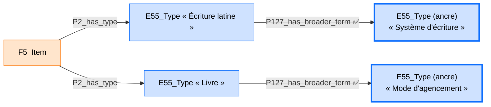

### Implications pour la modélisation
- Le périmètre passe de 29 à 31 propriétés (`P127_has_broader_term`/`P127i_has_narrower_term` — deux propriétés, zéro classe).
- **Nouveau fichier compagnon à créer et à maintenir**, avec **7 ancres** (pas seulement 2) — une par facette déjà identifiée dans le diagramme actuel. Ce nombre grandira si de nouvelles facettes apparaissent dans de futurs documents.
- Aucune tension avec le principe de composition pure : propriété CIDOC-CRM native, explicitement prévue pour ce rôle par la note de balisage d'`E55_Type` elle-même.
- Le fait que la notation `{...}` de la documentation LRMoo officielle couvre une vingtaine de facettes différentes confirme que ce n'est pas une difficulté anecdotique de CAO_CRM — c'est une caractéristique structurelle de tout modèle basé sur CIDOC-CRM/LRMoo qui utilise `E55_Type` de façon extensive, et `P127_has_broader_term` en est la réponse générale, réutilisable pour toute facette future, pas seulement les 7 déjà listées.
- Rappel de la réserve du Problème 1 : l'attribut officiel « Script » (`LRM-E9-A8`) est défini pour `F12_Nomen`, pas directement pour `F5_Item`/`D1_Digital_Object` — l'appliquer à ces derniers reste une extension par analogie, pas une correspondance exacte (voir discussion : adopter `F12_Nomen` résoudrait cette réserve précise, mais n'élimine pas le besoin de `P127_has_broader_term`, puisque `LRM-E9-A1` et `LRM-E9-A8` utilisent toutes deux `P2_has_type`/`E55_Type` au sein même de `F12_Nomen`).

### Note honnête sur la nature de cet usage — une extension du mécanisme de tesauro, pas son cas d'usage canonique

*Ajouté le 6 juillet 2026, suite à l'auditoria-2-documentacion-y-conformidad.md (section B.1).*

La note de balisage officielle d'`E55_Type` (citée intégralement en haut de cette section) décrit `P127_has_broader_term` comme le mécanisme pour construire des **hiérarchies de tesauro navigables par un usager humain** — quelqu'un qui cherche « Écriture », trouve ses espèces, ou part d'« Écriture latine » pour remonter vers des concepts plus larges ayant un sens propre et assignable, dans l'esprit du « broader term generic (BTG) » d'ISO 25964-2.

**Ce n'est pas exactement ce que font ici les 7 ancres.** La relation genre-espèce elle-même est correcte cas par cas (« Écriture latine » est bien une espèce du genre « Système d'écriture ») — il n'y a pas d'erreur catégorielle, contrairement à l'usage indu de `P150_defines_typical_parts_of` corrigé plus haut au Problème 2. Mais la **motivation réelle** de ces 7 ancres n'est pas de bâtir un tesauro que quelqu'un naviguerait pour son intérêt thématique propre : c'est de **désambiguïser automatiquement, par requête SPARQL, à quelle facette appartient chaque valeur d'`E55_Type`** quand plusieurs facettes distinctes partagent la même propriété générique `P2_has_type` — un besoin de **schéma** (savoir à quel « champ » appartient une valeur), résolu ici avec un mécanisme pensé pour des **données de tesauro** (des relations sémantiques entre concepts réels).

**Ce n'est pas une erreur logique** — le raisonneur ne l'objecte pas, et chaque relation BTG prise isolément est sémantiquement correcte — mais c'est une **tension d'intention** à assumer explicitement, de la même façon que ce document reconnaît déjà, un peu plus loin, que l'application du patron officiel « Script » (`LRM-E9-A8`, prévu pour `F12_Nomen`) à `F5_Item`/`D1_Digital_Object` « reste une extension par analogie du patron officiel — cohérente dans son principe, mais pas une correspondance exacte au cas d'usage officiel ». Les 7 ancres de `P127_has_broader_term` méritent la même honnêteté : c'est un usage délibérément étendu du mécanisme de tesauro de CIDOC-CRM, au-delà de son cas d'usage canonique de hiérarchie navigable, pour résoudre un problème de désambiguïsation de schéma — pas une non-conformité, mais pas non plus l'emploi « manuel » du mécanisme.

### Note pour référence future — `F12_Nomen`, une piste alternative non retenue pour l'instant

*Cette note documente une possibilité examinée et écartée pour le moment — pas une décision, juste une piste gardée en mémoire si le besoin réapparaît.*

**Ce qu'est `F12_Nomen`, citation officielle complète** (`imports/vendor/lrmoo-1.1.1.rdf`) :
> *« This class comprises associations between an instance of any class, and signs or arrangements of signs that are used to refer to and identify that instance. Signs include alphanumeric characters, ideograms, notations such as chemical structure symbols, sound symbols, etc. The scripts or type sets for the symbols used to compose an instance of F12 Nomen have to be sufficiently specified. Spelling variants are regarded as different nomens, whereas the use of different fonts (visual representation variants) or different digital encodings do not change the identity. An arbitrary combination of signs or symbols cannot be regarded as an appellation or designation until it is associated with something in some context. In that sense, the F12 Nomen class can be understood as the reification of a relationship between an instance of E1 CRM Entity and an instance of E41 Appellation. Two instances of F12 Nomen can happen to be associated with equivalent strings and yet remain distinct, as long as they refer to distinct instances of E1 CRM Entity. Furthermore, two instances of F12 Nomen referring to the same instance of E1 CRM Entity may be associated with equivalent strings, and remain distinct as long as they are associated with distinct properties of the F12 Nomen class (for example, having the same spelling in different languages, or being defined in different controlled vocabularies). [...] Instances of F12 Nomen are assigned and associated with instances of E1 CRM Entity either formally (such as by bibliographic agencies) or informally through common usage. »*
> — `rdfs:subClassOf` : `E89_Propositional_Object`.

**Définition courte officielle (LRMoo v1.0, tableau 8.1, `LRM-E9`) :** *« An association between an entity and a designation that refers to it »* → `F12 Nomen`.

**Les propriétés propres de `F12_Nomen` qui seraient pertinentes ici, citations complètes** (`imports/vendor/lrmoo-1.1.1.rdf`) :

> `R33_has_string` — *« This property associates an instance of F12 Nomen with a sign or arrangement of signs that is used to refer to something through that instance of F12 Nomen. »* — domaine `F12_Nomen`, portée `rdfs:Literal`, **`rdfs:subPropertyOf` : `P3_has_note`** (le même mécanisme que celui retenu pour « Description » au Problème 1).

> `R54_has_language` — *« This property associates an instance of F12 Nomen with an instance of E56 Language which is the language used for or associated with the nomen. »* — domaine `F12_Nomen`, portée `E56_Language`, `rdfs:subPropertyOf` : `P2_has_type` (donc une spécialisation du même mécanisme générique, mais avec une portée dédiée — moins ambiguë par construction, puisque `E56_Language` n'est pas `E55_Type`).

> `R35_is_specified_by` (inverse `R35i_specifies`) — *« This property associates an instance of F12 Nomen with an instance of F2 Expression which documents, defines or provides evidence for the particular nomen in the stated sense. »* — domaine `F12_Nomen`, portée `F2_Expression`.

**Et l'attribut « Script » lui-même (LRMoo v1.0, tableau 8.2, `LRM-E9-A8`) :** *« The script in which the nomen string is notated »* → `F12 Nomen. P2 has type: E55 Type {Script}`.

**Pourquoi ce n'est pas retenu maintenant :** le chaînon qui relierait concrètement `F5_Item` à son `F12_Nomen` — documenté dans la table LRM comme passant par `F52_Name_Use` et la propriété `R64i` (*« was name used by »*) — **n'existe pas dans notre fichier vendorisé `imports/vendor/lrmoo-1.1.1.rdf`** (vérifié aujourd'hui : aucune occurrence de `F52_Name_Use` ni de `R64`/`R64i` dans ce fichier). Adopter `F12_Nomen` correctement demanderait donc d'abord d'élucider ou d'importer ce chaînon manquant — ce n'est pas un simple ajout d'une classe, mais l'ouverture d'une famille de classes/propriétés encore incomplète dans notre périmètre actuel.

**À garder en tête pour l'avenir :** si l'équipe a un jour besoin de distinguer plusieurs noms/titres d'un même document, chacun avec sa propre langue ou son propre système d'écriture (par exemple un titre en français et une transcription dans un autre alphabet), `F12_Nomen` est la piste officiellement prévue pour cela — mais elle demandera cette investigation complémentaire avant d'être exploitable.

---

## Problème 2 — `P150_defines_typical_parts_of` détourné pour la langue, et posé au mauvais niveau (Manifestation au lieu d'Expression)

### En une phrase

Le diagramme veut dire « ce livre est écrit en français », mais utilise pour cela une flèche qui, officiellement, sert à autre chose — et en plus, il l'accroche au mauvais endroit du dossier du livre.

### L'explication, sans aucun terme technique non expliqué

Imaginez une fiche de bibliothèque en papier, avec des cases pré-imprimées : « Titre », « Auteur », « Format »... Chaque case a une étiquette qui dit précisément quel genre d'information peut y aller. CIDOC-CRM, LRMoo et CRMdig — les trois référentiels sur lesquels CAO_CRM est construit — fonctionnent de la même façon, mais de manière beaucoup plus stricte : ce sont des ensembles de « cases » (qu'on appelle des **classes**, par exemple `F3_Manifestation`, qui représente une édition d'un livre) reliées entre elles par des « flèches numérotées » (qu'on appelle des **propriétés**, par exemple `P150`), et chaque flèche a une règle stricte : elle ne peut relier que certains types de cases à certains autres types de cases précis. Si on essaie de l'utiliser entre deux cases qui ne correspondent pas à sa règle, ce n'est pas juste « maladroit » — c'est concrètement impossible à écrire correctement dans le fichier informatique final (le fichier `.rdf`), un peu comme brancher une prise électrique dans un port qui n'est pas fait pour elle : ça ne rentre pas, ou si on force, rien ne fonctionne derrière.

**Ce que le diagramme essaie de dire ici, c'est quelque chose de tout simple : « ce livre est écrit en français ».** Pour l'exprimer, il utilise la flèche `P150_defines_typical_parts_of`. Le problème, c'est que cette flèche précise n'a jamais été prévue pour ça.

**Ce que `P150` veut dire, réellement, avec l'exemple que le CIDOC-CRM donne lui-même dans sa documentation officielle** (citation complète plus bas) : *« les moteurs de voiture sont typiquement une partie des voitures »*. Regardez bien cette phrase : ce n'est pas une phrase sur UNE voiture précise (comme « ma voiture a un moteur diesel ») — c'est une phrase générale, qui parle de deux catégories entières (les moteurs de voiture, en général ; les voitures, en général), pour construire un dictionnaire de classement (un thésaurus). Cette flèche sert à dire « dans notre système de classement, telle catégorie de choses se range typiquement sous telle autre catégorie » — pas à décrire un livre réel, précis, qui est devant nous.

Or « ce livre est en français » est exactement l'inverse : c'est un fait sur UN livre précis, pas une règle générale valable pour toutes les catégories de livres et de langues. C'est comme utiliser, sur un formulaire administratif, la case prévue pour « le règlement général de l'entreprise » afin d'y écrire le nom d'un employé précis : la case existe, elle est valide, mais pas pour ce qu'on veut y mettre.

**Il y a un second problème, indépendant du premier.** Même si on choisissait la bonne flèche pour dire « ce livre est en français », elle serait aujourd'hui accrochée au mauvais endroit du dossier du livre. La documentation officielle distingue plusieurs « niveaux » pour un même livre : l'**Œuvre** (l'idée intellectuelle du livre, indépendante de toute langue ou édition — `F1_Work`), l'**Expression** (le texte précis, avec ses mots exacts, dans une langue précise — `F2_Expression`), la **Manifestation** (telle édition papier ou telle édition numérique de ce texte — `F3_Manifestation`), l'**Item** (l'exemplaire physique concret qu'on tient en main — `F5_Item`). Le diagramme accroche la langue au niveau « Manifestation » (l'édition), mais la documentation officielle place cet attribut au niveau « Expression » (le texte). Pourquoi cette distinction a du sens concrètement : le même texte français de Stendhal (une seule Expression) pourrait exister dans plusieurs éditions différentes — grand format, poche, numérique (plusieurs Manifestations) — et la langue ne change pas d'une édition à l'autre : elle appartient au texte, pas au format de publication.

---

### Ce que le graphe affirme réellement — vérifié sur les 9 pages du diagramme

**Correction de méthode :** le diagramme `CRM_V8.json` contient 9 pages (`model`, `Hiérarchie`, `F1`, `F2`, `F3`, `F5`, `D1`, `D2`, `exemple`) — l'arête ci-dessous a été recherchée sur les 9, pas seulement sur `model`. Elle apparaît sur 3 : `model`, `F3`, `exemple`.

La page `exemple` montre le contexte complet, avec les annotations humaines d'origine :
```
F3_Manifestation --P106_is_composed_of-->  E90_Symbolic_Object   (annoté « Langues »)
E56_Language ("Langage original")  --P150_defines_typical_parts_of-->  [la même case « Langues »]
```

Le diagramme crée donc une case `E90_Symbolic_Object` nommée « Langues », rattachée à `F3_Manifestation` par une arête légale (`P106_is_composed_of`), puis tente d'y accrocher une langue au moyen de `P150_defines_typical_parts_of`.

**Pour être complet, la citation officielle de cette première arête (`P106_is_composed_of`), qui elle est correcte et ne pose aucun problème** (`imports/vendor/cidoc-crm-7.1.3.rdf`) :
> *« This property associates an instance of E90 Symbolic Object with a part of it that is by itself an instance of E90 Symbolic Object, such as fragments of texts or clippings from an image. This property is transitive asymmetric. »*
> — `rdfs:domain` : `E90_Symbolic_Object` ; `rdfs:range` : `E90_Symbolic_Object`. Correcte ici car `F3_Manifestation` est, par héritage (`F3_Manifestation → E73_Information_Object → E90_Symbolic_Object`, vérifié), elle-même un `E90_Symbolic_Object`.

### Pourquoi c'est incorrect — avec documentation complète, deux défauts distincts

**Défaut 1 — la propriété ne convient pas.** Déclaration officielle complète, texte intégral (`imports/vendor/cidoc-crm-7.1.3.rdf`) :
> *« This property associates an instance of E55 Type "A" with an instance of E55 Type "B", when items of type "A" typically form part of items of type "B", such as "car motors" and "cars". It allows types to be organised into hierarchies based on one type describing a typical part of another. This property is equivalent to "broader term partitive (BTP)" as defined in ISO 2788 and "broaderPartitive" in SKOS. This property is not transitive. This property is asymmetric. »*
> — `rdfs:domain` : `E55_Type` ; `rdfs:range` : `E55_Type`.

Pour vérifier ce défaut il faut regarder deux choses : ce qui a le droit d'être à gauche de la flèche (ici `E56_Language`, la langue), et ce qui a le droit d'être à droite (ici `E90_Symbolic_Object`, l'objet symbolique). La règle officielle dit : les deux côtés doivent être des `E55_Type` (des « catégories », pas des choses concrètes).

- Côté gauche : `E56_Language` est déclarée, texte intégral, *« This class is a specialization of E55 Type and comprises the natural languages in the sense of concepts. »* — donc oui, `E56_Language` est bien un `E55_Type`. Ce côté est correct.
- Côté droit : `E90_Symbolic_Object` est déclarée, texte intégral (`imports/vendor/cidoc-crm-7.1.3.rdf`) : *« This class comprises identifiable symbols and any aggregation of symbols, such as characters, identifiers, traffic signs, emblems, texts, data sets, images, musical scores, multimedia objects, computer program code, or mathematical formulae that have an objectively recognizable structure and that are documented as single units. It includes sets of signs of any nature, which may serve to designate something, or to communicate some propositional content. »* — avec `rdfs:subClassOf` : `E28_Conceptual_Object` et `E72_Legal_Object`. **Jamais `E55_Type`.** Ce côté échoue.

Le défaut de fond, en clair : `P150` relie deux *catégories abstraites* entre elles (« les moteurs de voiture sont typiquement une partie des voitures » — un fait sur des types de choses, utile pour construire un dictionnaire de classement) — ce n'est pas fait pour dire « ce document précis est dans cette langue précise », qui est un fait sur un objet réel, pas sur deux catégories.

**Défaut 2 — même en choisissant la bonne flèche, ce n'est pas le bon endroit du dossier.** La documentation officielle **LRMoo v1.0** (tableau 8.2, ligne `LRM-E3-A6`, vérifiée directement sur le document PDF officiel, texte intégral de la cellule) place l'attribut Langue à l'**Expression**, pas à la Manifestation :
> *« Language — A language used in the expression »* → `F2 Expression (instantiated as E33 Linguistic Object). P72 has language: E56 Language`

**La propriété correcte, citation officielle complète** (`imports/vendor/cidoc-crm-7.1.3.rdf`) :
> *« This property associates an instance(s) of E33 Linguistic Object with an instance of E56 Language in which it is, at least partially, expressed. »*
> — `rdfs:domain` : `E33_Linguistic_Object` ; `rdfs:range` : `E56_Language`.

**Et la classe `E33_Linguistic_Object` elle-même, citation officielle complète** (`imports/vendor/cidoc-crm-7.1.3.rdf`) :
> *« This class comprises identifiable expressions in natural language or languages. Instances of E33 Linguistic Object can be expressed in many ways: e.g. as written texts, recorded speech, or sign language. However, the CIDOC CRM treats instances of E33 Linguistic Object independently from the medium or method by which they are expressed. Expressions in formal languages, such as computer code or mathematical formulae, are not treated as instances of E33 Linguistic Object by the CIDOC CRM. These should be modelled as instances of E73 Information Object. »*

C'est cohérent avec l'explication donnée plus haut sans jargon : la langue appartient au contenu linguistique (l'Expression), pas à la forme éditoriale concrète (la Manifestation) — une même Expression pourrait en théorie être incarnée par des Manifestations distinctes sans que sa langue change.

### Ce qu'il faut changer — recommandation claire

**Retirer complètement la « Langue » de `F3_Manifestation`.** Ce n'est pas seulement remplacer une flèche par une autre au même endroit — c'est déplacer l'attribut vers `F2_Expression`, seul niveau conforme à l'usage correct des trois modèles (CIDOC-CRM, LRMoo, CRMdig) tel que documenté officiellement. Garder la langue sur la Manifestation, même avec une flèche légale, resterait un choix non conforme au patron officiel `LRM-E3-A6`.

La bonne nouvelle : la flèche nécessaire pour retrouver la langue d'une Manifestation existe déjà et est déjà légale dans notre graphe — `R4_embodies` (`F3_Manifestation → F2_Expression`), citation officielle complète vérifiée aujourd'hui (`imports/vendor/lrmoo-1.1.1.rdf`) :
> *« This property associates an instance of F3 Manifestation with one or more instances of F2 Expression which are rendered by this instance of F3 Manifestation. The manifestation formats the expression(s) in the way they are to be presented to some public, including specifying the intended sensory impression (such as visual appearance or audio rendition). »*
> — `rdfs:domain` : `F3_Manifestation` ; `rdfs:range` : `F2_Expression` ; `rdfs:subPropertyOf` : `P165_incorporates` ; `owl:inverseOf` : `R4i_is_embodied_in`.

Donc : rien de nouveau à créer pour relier Manifestation à Expression — cette flèche existe déjà dans notre ontologie et est déjà correcte. Il suffit de déplacer où vit la langue, et de s'appuyer sur ce chemin déjà présent pour la retrouver depuis la Manifestation quand on en a besoin (même logique que le Principe 3 du document parent : emprunter le chemin légal déjà existant plutôt que forcer un raccourci direct).

**Pour résumer avec l'image du dossier de bibliothèque :** on ne colle pas l'étiquette « langue » sur la pochette de l'édition (la Manifestation) — on la colle sur la feuille du texte lui-même (l'Expression), qui se trouve rangée à l'intérieur de cette pochette. Si quelqu'un demande « dans quelle langue est cette édition-ci ? », on ouvre la pochette, on regarde la feuille de texte qui s'y trouve, et sa langue est la réponse — pas besoin d'une deuxième étiquette « langue » collée directement sur la pochette.

### A. Changements à faire dans le diagramme visuel

- Sur la page `exemple` (et partout où le patron se répète, `model`/`F3`) : **supprimer** la case `E90_Symbolic_Object`/« Langues » et les deux arêtes qui y aboutissent (`P106_is_composed_of` depuis `F3_Manifestation`, `P150_defines_typical_parts_of` depuis `E56_Language`).
- Sur la page `F2` (Expression) : ajouter une case `E33_Linguistic_Object` (co-typée avec `F2_Expression`), reliée à une case `E56_Language` par une arête `P72_has_language (P72i_is_language_of)` — même patron visuel `Propriété\n(iPropriété)` déjà utilisé ailleurs.
- Ne rien changer à l'arête `F3_Manifestation --R4_embodies--> F2_Expression` : elle reste, et devient le chemin pour retrouver la langue depuis la Manifestation.

### B. Changements à faire dans le RDF

**À ajouter au périmètre et à extraire** (absents aujourd'hui) : `E33_Linguistic_Object`, `P72_has_language`/`P72i_is_language_of`.

**État actuel (❌) :**
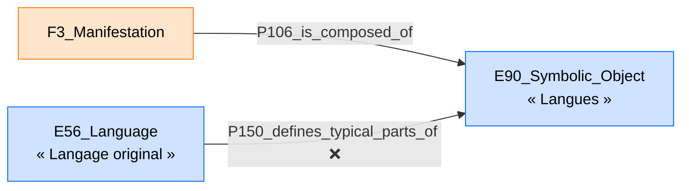

**Proposition (✅) — la langue déplacée vers l'Expression, retrouvée depuis la Manifestation par le chemin déjà légal :**
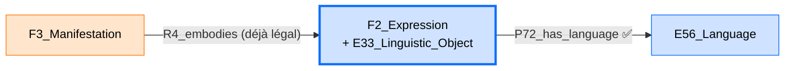
```turtle
:expression_le_rouge_et_le_noir  a lrmoo:F2_Expression, cidoc:E33_Linguistic_Object ;
                                   cidoc:P72_has_language  :langue_francaise .

:manifestation_1830  a lrmoo:F3_Manifestation ;
                      lrmoo:R4_embodies  :expression_le_rouge_et_le_noir .
```

### Implications pour la modélisation
- Périmètre : +1 classe (`E33_Linguistic_Object`), +2 propriétés (`P72_has_language`/`P72i_is_language_of`) — parmi les trois modèles officiels, aucune tension.
- **Décision confirmée le 6 juillet 2026 : on respecte LRMoo — la langue va à l'Expression, jamais à la Manifestation.** Ce n'est plus une option ouverte.
- **Citation renforçante ajoutée le 6 juillet 2026** (suite à l'auditoria-2-documentacion-y-conformidad.md, section B.2) : au-delà de l'analogie via `E34_Inscription`/MARC21 déjà utilisée plus haut, la documentation officielle de `F2_Expression` elle-même (`imports/vendor/lrmoo-1.1.1.rdf`) tranche directement la question, sans besoin d'inférence :
  > *« An instance of F2 Expression which includes spoken or written text may be multiply instantiated as an instance of E33 Linguistic Object. This allows for the association of the E56 Language of the text with the instance of F2 Expression by using the property P72 has language (is language of). »*

  Ce n'est donc pas seulement « une pratique courante en OWL » (formule employée plus bas dans cette section) appliquée par analogie : c'est l'instruction textuelle explicite et nommée du modèle LRMoo pour ce cas précis — la décision déjà prise ici en est d'autant plus solidement fondée.
- Nécessite de co-typer chaque instance de `F2_Expression` concernée aussi comme `E33_Linguistic_Object` (double appartenance de classe, pratique courante en OWL — et ici, comme le montre la citation ci-dessus, explicitement prévue par la norme elle-même, pas seulement tolérée par elle).
- Vérifier, dans les données déjà chargées (cas Stendhal), si une instance de `F2_Expression` existe déjà pour y rattacher la langue — sinon, il faudra la créer.

### Correction requise dans le paper — le tableau de métadonnées place aujourd'hui la langue au mauvais niveau

Cette décision rend nécessaire une correction du paper (`Paper_Article_Revue HN_V2.docx.pdf`), dont le tableau de métadonnées (section 4.1) place aujourd'hui « Langue » sous « Manifestation » — et qui, de plus, ne comporte aucune ligne « Expression » du tout.

**Texte actuel du tableau (extrait) :**
```
 Manifestation           Caractéristiques         Identifiant (E42              [Édition de 1786]
                                                  Identifier)

 Manifestation           Caractéristiques         Type (E55 Type)               Édition

 Manifestation           Caractéristiques         Langue (E56 Language)         Français
```

**Texte proposé pour remplacer cet extrait** (ligne « Langue » déplacée vers une nouvelle ligne « Expression », insérée juste avant la ligne « Manifestation ») :
```
 Expression              Caractéristiques         Langue (E56 Language)         Français

 Manifestation           Caractéristiques         Identifiant (E42              [Édition de 1786]
                                                  Identifier)

 Manifestation           Caractéristiques         Type (E55 Type)               Édition
```
Cette correction crée, au passage, la première ligne « Expression » du tableau — jusqu'ici totalement absente, alors que le corps du texte du paper (section 3.1) décrit bien `F2_Expression` comme un niveau à part entière du modèle.

---

## Problème 3 — `P7_took_place_at` sur `E3_Condition_State`, et la découverte d'un vrai manque ailleurs (la localisation de l'exemplaire)

### En une phrase

Le diagramme veut dire « voici où se trouve/où s'est produit l'état de conservation de ce livre », mais utilise une flèche qui ne convient pas à un état de conservation — et en creusant, on découvre qu'il manque, ailleurs dans le modèle, la vraie information qui était probablement visée : **où est rangé/conservé l'exemplaire physique lui-même**, qui n'apparaît nulle part dans tout le diagramme.

### L'explication, sans aucun terme technique non expliqué

Un livre ancien, avec le temps, peut passer par différents **états** : « en bon état », « abîmé par l'humidité », « restauré ». CIDOC-CRM a une case spécifique pour noter cela — `E3_Condition_State` — accompagnée d'un exemple officiel : *« l'état du navire SS Great Britain entre le 22 septembre 1846 et le 27 août 1847 peut être caractérisé comme 'naufragé' »*.

Le diagramme essaie d'ajouter : « et cet état, où a-t-il eu lieu ? », en utilisant la flèche `P7_took_place_at`. Le souci : **cette flèche n'a pas été prévue pour un état de conservation.**

### Pourquoi c'est incorrect — avec documentation complète

**Ce que le graphe affirme :**
```
E3_Condition_State --P7_took_place_at--> E53_Place
```
Vérifié aujourd'hui sur les 9 pages du diagramme : apparaît sur 3 (`model`, `F5`, `exemple`) — ce n'est pas une coquille isolée.

**La règle officielle de `P7_took_place_at`, texte intégral** (`imports/vendor/cidoc-crm-7.1.3.rdf`) :
> *« This property describes the spatial location of an instance of E4 Period. The related instance of E53 Place should be seen as a wider approximation of the geometric area within which the phenomena that characterise the period in question occurred [...] For example, the period "Révolution française" can be said to have taken place in "France in 1789"; the "Victorian" period may be said to have taken place in "Britain from 1837-1901" and its colonies [...] »*
> — `rdfs:domain` : `E4_Period` ; `rdfs:range` : `E53_Place`.

Les exemples que la norme donne elle-même — la Révolution française, l'époque victorienne — sont des **phénomènes historiques amples, liés à un territoire**. `E4_Period` est la case pensée pour cela.

**Est-ce que `E3_Condition_State` est une sorte de `E4_Period` ?** Non — vérifié, texte intégral (`imports/vendor/cidoc-crm-7.1.3.rdf`) :
> *« This class comprises the states of objects characterised by a certain condition over a time-span. An instance of this class describes the prevailing physical condition of any material object or feature during a specific instance of E52 Time-Span. [...] The nature of that condition can be described using P2 has type. For example, the instance of E3 Condition State "condition of the SS Great Britain between 22-nd September 1846 and 27-th August 1847" can be characterized as an instance "wrecked" of E55 Type. »*
> — `rdfs:subClassOf` : `E2_Temporal_Entity`.

Et la classe mère commune, texte intégral, tranche la question sans ambiguïté (`imports/vendor/cidoc-crm-7.1.3.rdf`) :
> *« [...] E2 Temporal Entity is specialized into E4 Period, which applies to a particular geographic area (defined with a greater or lesser degree of precision), and E3 Condition State, which applies to instances of E18 Physical Thing. »*
> — `rdfs:subClassOf` d'`E2_Temporal_Entity` : `E1_CRM_Entity`.

Autrement dit : `E4_Period` et `E3_Condition_State` sont **deux branches sœurs**, toutes deux filles d'`E2_Temporal_Entity` — aucune n'est la fille de l'autre. C'est comme essayer de traiter votre frère comme s'il était votre père : vous avez un ancêtre commun, mais l'un ne descend pas de l'autre. La flèche `P7_took_place_at`, qui exige un descendant d'`E4_Period`, ne peut donc pas légalement partir d'`E3_Condition_State`.

### Ce qui rend ce cas différent des sept autres — et la découverte faite en creusant la question

Pour les autres problèmes de ce document, la réparation était plutôt mécanique (changer de flèche, ou ajouter une sous-classe qui manquait). Ici, **`E3_Condition_State` n'a, dans toute la norme officielle, aucune propriété directe vers un lieu** — CIDOC-CRM n'a simplement jamais prévu « où a eu lieu cet état » comme une question à réponse directe pour cette classe précise.

En se demandant *ce que le diagramme cherchait probablement à exprimer*, une vérification complète des 9 pages du diagramme a été faite : **existe-t-il, ailleurs dans tout CAO_CRM, une façon de dire où se trouve concrètement rangé/conservé l'exemplaire physique (`F5_Item`) ?** Réponse, vérifiée aujourd'hui : **nulle part.** Les seuls lieux présents dans tout le diagramme concernent des naissances/décès de personnes et des lieux de production — jamais « où cet exemplaire est-il conservé aujourd'hui ».

**Or ce besoin a un mécanisme officiel prévu spécifiquement pour cela**, déjà repéré dans un autre travail (tableau des attributs LRMoo, `LRM-E5-A1`, vérifié directement sur le document officiel) :
> *« Location — The collection and/or institution in which the item is held, stored, or made available for access »* →
> - localisation fixe : `F5 Item. P54 has current permanent location: E53 Place`
> - localisation actuelle : `F5 Item. P55 has current location: E53 Place`

**Citation officielle complète de `P54_has_current_permanent_location`** (`imports/vendor/cidoc-crm-7.1.3.rdf`) :
> *« This property records the foreseen permanent location of an instance of E19 Physical Object at the time of validity of the record or database containing the statement that uses this property. P54 has current permanent location (is current permanent location of) is similar to P55 has current location (currently holds). However, it indicates the E53 Place currently reserved for an object, such as the permanent storage location or a permanent exhibit location. The object may be temporarily removed from the permanent location [...] The object may never actually be located at its permanent location. »*
> — `rdfs:domain` : `E19_Physical_Object` ; `rdfs:range` : `E53_Place`.

**Citation officielle complète de `P55_has_current_location`** (`imports/vendor/cidoc-crm-7.1.3.rdf`) :
> *« This property records the location of an instance of E19 Physical Object at the time of validity of the record or database containing the statement that uses this property. This property is a specialisation of P53 has former or current location (is former or current location of). It indicates that the instance of E53 Place associated with the instance of E19 Physical Object is the current location of the object. »*
> — `rdfs:domain` : `E19_Physical_Object` ; `rdfs:range` : `E53_Place`.

**Un point technique important, vérifié pour ne pas se tromper :** ces deux propriétés exigent officiellement un `E19_Physical_Object`. Or `F5_Item` est déclarée sous-classe d'`E24_Physical_Human-Made_Thing`, **pas** directement d'`E19_Physical_Object` (ce sont deux branches distinctes). Mais le commentaire officiel de `F5_Item` lui-même résout cette question, texte intégral (`imports/vendor/lrmoo-1.1.1.rdf`) :
> *« An instance of F5 Item that consists of a physical object or set of objects with clear physical boundaries is also an instance of E22 Human-Made Object. [...] From an operational point of view, cultural heritage institutions typically do not manage instances of F5 Item, but physical holdings units, instances of E19 Physical Object, although for libraries in most cases this is not significant because each item corresponds with a single unit. »*

Et `E22_Human-Made_Object` est bien déclarée sous-classe d'`E19_Physical_Object` (vérifié, `imports/vendor/cidoc-crm-7.1.3.rdf`) :
> *« This class comprises all persistent physical objects of any size that are purposely created by human activity and have physical boundaries that separate them completely in an objective way from other objects. »*
> — `rdfs:subClassOf` : `E19_Physical_Object`, `E24_Physical_Human-Made_Thing`.

**En clair, pour qui n'a jamais fait d'ontologie :** un exemplaire de livre, dans CIDOC-CRM/LRMoo, porte en réalité deux étiquettes de classe en même temps — « Exemplaire » (`F5_Item`, le point de vue bibliographique) et « Objet fabriqué par l'humain » (`E22_Human-Made_Object`, le point de vue de la gestion physique/des collections) — et c'est la **seconde** étiquette qui donne accès à « où est-il rangé ». La documentation officielle dit elle-même que c'est le cas normal pour un livre.

### Recommandation

**Ne pas chercher à raccrocher un lieu à `E3_Condition_State` — ce n'est structurellement pas prévu pour cela, quelle que soit la flèche choisie.** À la place : co-typer chaque instance concrète de `F5_Item` (le livre physique) aussi comme `E22_Human-Made_Object`, et lui donner sa localisation avec `P54`/`P55`. Cela répond probablement au vrai besoin qui se cachait derrière la tentative originale — « où se trouve ce livre » — sans jamais toucher à l'état de conservation.

### A. Changements à faire dans le diagramme visuel

- Sur les pages `model`, `F5`, `exemple` : **supprimer** l'arête `E3_Condition_State --P7_took_place_at--> E53_Place`.
- Ajouter, sur la page `F5` (Exemplaire), une case `E22_Human-Made_Object` co-typée avec `F5_Item`, reliée à une case `E53_Place` par deux arêtes possibles : `P54_has_current_permanent_location (P54i_is_current_permanent_location_of)` et/ou `P55_has_current_location (P55i_currently_holds)` — patron visuel `Propriété\n(iPropriété)` déjà utilisé ailleurs.
- Ne rien changer à la case `E3_Condition_State` elle-même ni à sa connexion via `P44_has_condition` — seule l'arête vers `E53_Place` disparaît.

### B. Changements à faire dans le RDF

**À ajouter au périmètre et à extraire** (absents aujourd'hui) : `E22_Human-Made_Object`, `P54_has_current_permanent_location`/`P54i_is_current_permanent_location_of`, `P55_has_current_location`/`P55i_currently_holds`.

**État actuel (❌) :**
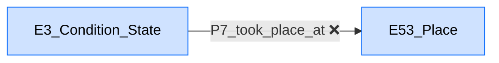

**Proposition (✅) — le lieu déplacé vers l'exemplaire lui-même, correctement co-typé :**
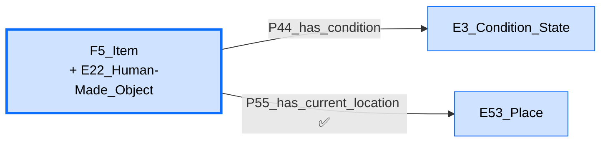
```turtle
:item_le_rouge_et_le_noir  a lrmoo:F5_Item, cidoc:E22_Human-Made_Object ;
                            cidoc:P44_has_condition  :etat_conservation ;
                            cidoc:P55_has_current_location  :bibliotheque_x .

:etat_conservation  a cidoc:E3_Condition_State ;
                     cidoc:P2_has_type  :valeur_bon_etat .
```

### Implications pour la modélisation
- Périmètre : +1 classe (`E22_Human-Made_Object`), +4 propriétés (`P54`/`P54i`, `P55`/`P55i`) — parmi les trois modèles officiels, aucune tension ; le mécanisme est explicitement prévu par la documentation même de `F5_Item`.
- **Ce problème, contrairement aux autres, ne se limitait pas à corriger une erreur — il a permis de découvrir un manque réel et important** : la localisation des exemplaires physiques n'existait nulle part dans le diagramme avant cette vérification.
- Vérifier, dans les données déjà chargées (cas Stendhal), si l'information de localisation existe déjà quelque part (même informellement, par exemple dans une note) pour ne pas la perdre en migrant vers cette structure.
- `E3_Condition_State` reste dans le modèle exactement comme avant, avec `P44_has_condition` et `P2_has_type` pour qualifier l'état — seule la tentative de lui donner un lieu disparaît.

---

## Problème 4 — `P104_is_subject_to` utilisée sur sept classes à la fois, dont trois ne conviennent pas

### En une phrase

Le diagramme utilise la même flèche « a un droit dessus » sur **sept classes différentes** — et cette flèche ne convient qu'à quatre d'entre elles. Le fait qu'elle soit répétée à l'identique sur les sept, sans varier, est probablement le signe d'un copier-coller au moment de la construction du diagramme, plutôt qu'un choix voulu à chaque fois — un enchaînement tout à fait compréhensible quand on construit un modèle aussi grand à la main, personne n'est à blâmer ici.

### L'explication, sans aucun terme technique non expliqué

Imaginez que vous étiquetez plusieurs tiroirs d'un meuble avec la même étiquette « Propriété de la bibliothèque », parce que c'était déjà écrit sur le premier tiroir et que vous avez recopié l'étiquette sur tous les autres sans revérifier si elle s'appliquait à chacun. C'est exactement le patron qu'on retrouve ici : la flèche `P104_is_subject_to` (« est soumis à » un droit) a été apposée de façon identique sur sept cases très différentes du diagramme, sans être adaptée à la nature de chacune.

### Ce que le graphe affirme réellement — vérifié sur les 9 pages, sept classes distinctes

Une recherche exhaustive sur les 9 pages du diagramme (pas seulement `model`) révèle que cette flèche part en réalité de **sept classes**, pas trois :

| Classe d'origine | Est-ce un `E72_Legal_Object` (la condition officielle) ? | Verdict |
|---|---|---|
| `F2_Expression` | Oui | ✅ Légal |
| `F3_Manifestation` | Oui | ✅ Légal |
| `D1_Digital_Object` | Oui | ✅ Légal |
| `F5_Item` | Oui — **découverte faite en vérifiant les 9 pages, absente de l'analyse initiale** | ✅ Légal |
| `F1_Work` | Non | ❌ Illégal |
| `E7_Activity` | Non | ❌ Illégal |
| `D2_Digitization_Process` | Non | ❌ Illégal |

### Pourquoi c'est incorrect — avec documentation complète

**La règle officielle, texte intégral** (`imports/vendor/cidoc-crm-7.1.3.rdf`) :
> *« This property links a particular instance of E72 Legal Object to the instances of E30 Right to which it is subject. The Right is held by an instance of E39 Actor as described by P75 possesses (is possessed by). »*
> — `rdfs:domain` : `E72_Legal_Object` ; `rdfs:range` : `E30_Right` ; `owl:inverseOf` : `P104i_applies_to`.

**Ce qu'est officiellement `E72_Legal_Object`, texte intégral, avec un passage qui vise directement notre cas** (`imports/vendor/cidoc-crm-7.1.3.rdf`) :
> *« This class comprises those material or immaterial items to which instances of E30 Right, such as the right of ownership or use, can be applied. This is generally true for all instances of E18 Physical Thing. In the case of instances of E28 Conceptual Object, however, the identity of an instance of E28 Conceptual Object or the method of its use may be too ambiguous to reliably establish instances of E30 Right, as in the case of taxa and inspirations. Ownership of corporations is currently regarded as out of scope of the CIDOC CRM. »*
> — `rdfs:subClassOf` : `E70_Thing`.

Vérifié aujourd'hui : dans toute la hiérarchie officielle, `E72_Legal_Object` n'a que deux sous-classes directes déclarées — `E18_Physical_Thing` et `E90_Symbolic_Object` (aucune troisième branche n'existe).

**Pourquoi les quatre premières classes du tableau réussissent le test :** `F2_Expression`, `F3_Manifestation` et `D1_Digital_Object` descendent toutes d'`E90_Symbolic_Object` (chaîne déjà vérifiée dans les problèmes précédents de ce document). `F5_Item` descend d'`E24_Physical_Human-Made_Thing`, elle-même sous-classe d'`E18_Physical_Thing` (vérifié, voir Problème 3) — donc `F5_Item` est bien, par héritage, un `E18_Physical_Thing`, donc un `E72_Legal_Object`.

**Pourquoi les trois dernières échouent :**

> **`F1_Work`**, texte intégral (`imports/vendor/lrmoo-1.1.1.rdf`) : *« This class comprises distinct intellectual ideas conveyed in artistic and intellectual creations, such a poems, stories or musical compositions. A Work is the outcome of an intellectual process of one or more persons. [...] »* — `rdfs:subClassOf` : `E89_Propositional_Object`, elle-même sous-classe d'`E28_Conceptual_Object`. C'est précisément la branche que la citation d'`E72_Legal_Object` ci-dessus désigne, en toutes lettres, comme *« too ambiguous to reliably establish instances of E30 Right »* — une œuvre, en tant qu'idée pure, est officiellement jugée trop abstraite pour qu'un droit s'y attache directement.

> **`E7_Activity`**, texte intégral (`imports/vendor/cidoc-crm-7.1.3.rdf`) : *« This class comprises actions intentionally carried out by instances of E39 Actor that result in changes of state in the cultural, social, or physical systems documented. »* — `rdfs:subClassOf` : `E5_Event`, elle-même `rdfs:subClassOf` : `E4_Period`. Une activité est un processus qui se déroule dans le temps — pas une chose à laquelle un droit s'applique directement.

> **`D2_Digitization_Process`**, texte intégral (`imports/vendor/crmdig-5.0.rdf`) : *« This class comprises events that result in the creation of instances of D9 Data Object that represent the appearance [...] of an instance of E18 Physical Thing such as paper documents, statues, buildings, paintings, biological objects etc. »* — `rdfs:subClassOf` : `D11_Digital_Measurement_Event`, dans la même branche « événement » que `E7_Activity`. Même défaut de nature.

**En clair, sans jargon :** un droit d'auteur ou de propriété se pose sur une *chose* — un objet physique qu'on peut tenir, ou un contenu qu'on peut lire/regarder. Il ne se pose pas sur une *idée pure* (l'Œuvre, avant toute réalisation concrète), ni sur un *événement* (l'activité de numériser, l'acte en train de se faire). C'est pour cela que la norme officielle exclut ces deux natures.

### Ce qu'il faut changer

Ne pas relier directement `F1_Work`, `E7_Activity` et `D2_Digitization_Process` à `E30_Right`. Le droit reste accessible en suivant des chemins déjà légaux et **déjà présents** dans notre ontologie, avec leurs citations officielles complètes :

> **`R3_is_realised_in`** (`F1_Work → F2_Expression`), texte intégral (`imports/vendor/lrmoo-1.1.1.rdf`) : *« This property associates an instance of F2 Expression with an instance of F1 Work. This property expresses the association that exists between an expression and the work that this expression conveys. »* — `rdfs:domain` : `F1_Work` ; `rdfs:range` : `F2_Expression`.

> **`P16_used_specific_object`** (`E7_Activity → E70_Thing`, couvre `F5_Item`), texte intégral (`imports/vendor/cidoc-crm-7.1.3.rdf`) : *« This property describes the use of material or immaterial things in a way essential to the performance or the outcome of an instance of E7 Activity. »* — `rdfs:domain` : `E7_Activity` ; `rdfs:range` : `E70_Thing`. Déjà utilisée et déjà légale dans notre diagramme entre `E7_Activity` et `F5_Item`.

> **`L11_had_output`** (`D2_Digitization_Process → D1_Digital_Object`, via `D7_Digital_Machine_Event`), texte intégral (`imports/vendor/crmdig-5.0.rdf`) : *« This property associates an instance of D7 Digital Machine Event with an instance of D1 Digital Object which is the output of the activity. »* — déjà corrigée et vérifiée légale dans notre ontologie (`D2_Digitization_Process` est sous-classe de `D7_Digital_Machine_Event`).

### A. Changements à faire dans le diagramme visuel

- Sur toutes les pages concernées (`model`, `F1`, `F5`, `D1`, `D2`, `exemple`) : **supprimer** les trois arêtes directes `F1_Work --P104_is_subject_to--> E30_Right`, `E7_Activity --P104_is_subject_to--> E30_Right`, `D2_Digitization_Process --P104_is_subject_to--> E30_Right`.
- Ne rien changer aux quatre arêtes légales (`F2_Expression`, `F3_Manifestation`, `D1_Digital_Object`, `F5_Item` vers `E30_Right`) — elles restent telles quelles.
- Vérifier que les arêtes de chemin (`R3_is_realised_in`, `P16_used_specific_object`, `L11_had_output`) sont bien visibles et présentes à côté, pour que la voie indirecte soit lisible sur le diagramme lui-même.
- **Suggestion méthodologique pour éviter que ce patron se reproduise :** lors de la prochaine relecture du diagramme, vérifier systématiquement si une flèche copiée d'une case à l'autre a bien été revérifiée pour la nouvelle case, plutôt que recopiée telle quelle.

### B. Changements à faire dans le RDF

**Rien à ajouter au périmètre** — les quatre classes légales et les trois propriétés de chemin (`R3_is_realised_in`, `P16_used_specific_object`, `L11_had_output`) sont déjà présentes et déjà correctes dans `ontology/CAO_CRM-1.0.rdf`.

**État actuel (❌) :**
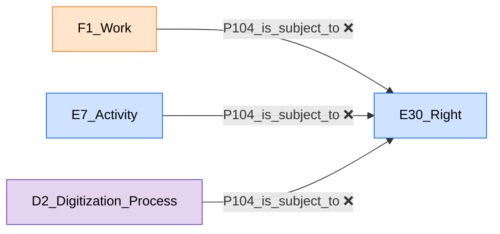

**Proposition (✅) — chemins déjà légaux et déjà présents :**
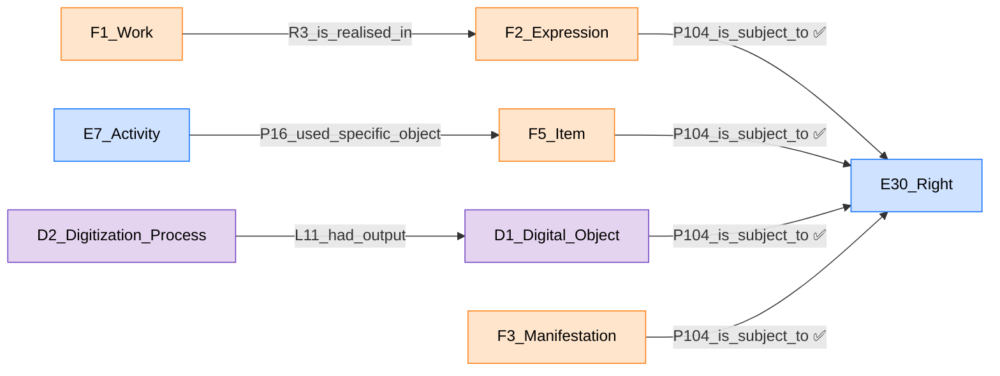
```turtle
:oeuvre_le_rouge_et_le_noir  lrmoo:R3_is_realised_in  :expression_le_rouge_et_le_noir .
:expression_le_rouge_et_le_noir  cidoc:P104_is_subject_to  :domaine_public .

:activite_numerisation  cidoc:P16_used_specific_object  :item_le_rouge_et_le_noir .
:item_le_rouge_et_le_noir  cidoc:P104_is_subject_to  :droit_conservation .

:processus_numerisation  crmdig:L11_had_output  :fichier_numerique .
:fichier_numerique  cidoc:P104_is_subject_to  :licence_cc_by .
```

### Implications pour la modélisation
- Aucun ajout de périmètre — tout ce qui est nécessaire existe déjà et est déjà correct dans notre ontologie.
- Il s'agit uniquement de retirer trois relations directes et de vérifier que le chemin indirect correspondant est bien renseigné dans les données déjà saisies (cas Stendhal) — sinon, compléter ces exemples.
- **Note constructive, sans chercher de responsable :** le fait que la même flèche, à l'identique, ait été posée sur sept classes de nature très différente (idées, événements, objets, contenus) suggère un copier-coller lors de la construction du diagramme — une case a été dupliquée pour aller plus vite, sans revérifier à chaque fois si la propriété recopiée restait valide pour la nouvelle classe. Ce n'est pas une critique adressée à qui que ce soit : avec un modèle de cette taille, construit à la main, ce genre de répétition est pratiquement inévitable, et c'est précisément le rôle de cette relecture systématique de la retrouver.

---

## Problème 5 — `R27_materialized` sur `E12_Production`, avec la preuve complète que rien ne se perd

### En une phrase

Le diagramme utilise la case générale « Production » là où la norme exige sa case fille spécifique, créée exactement pour ce cas — et ce changement ne fait perdre aucune des autres informations déjà accrochées (date, lieu, acteur, type).

### L'explication, sans aucun terme technique non expliqué

Imaginez la fabrication d'une édition de livre : on imprime, par exemple, 2000 exemplaires identiques de « Le Rouge et le Noir ». CIDOC-CRM a une case très générale, `E12_Production`, qui sert pour **n'importe quelle** activité qui fabrique des choses nouvelles — de l'impression d'un livre à la forge d'une épée. LRMoo a créé, à l'intérieur de cette case générale, une case **plus précise**, pensée exactement pour « fabriquer des exemplaires d'une édition » : `F32_Item_Production_Event`. Et cette case précise est la seule à avoir officiellement le droit d'utiliser la flèche `R27_materialized` (« a matérialisé telle Manifestation »). Le diagramme utilise la case générale à la place de la case précise — comme utiliser le mot « véhicule » dans un formulaire qui exige spécifiquement « voiture ».

### Ce que le graphe affirme réellement — vérifié sur les 9 pages

```
E12_Production --R27_materialized--> F3_Manifestation
```
Confirmé sur 3 pages (`model`, `Hiérarchie`, `exemple`).

### Pourquoi c'est incorrect — avec documentation complète

**`R27_materialized`, texte intégral** (`imports/vendor/lrmoo-1.1.1.rdf`) :
> *« This property associates an instance of F32 Item Production Event with the set of signs provided by the publisher to be carried by all of the produced items (i.e., the instances of F5 Item) and any other physical features foreseen as integral to the instance of F3 Manifestation that is materialised. »*
> — `rdfs:domain` : `F32_Item_Production_Event` ; `rdfs:range` : `F3_Manifestation`.

**`F32_Item_Production_Event`, texte intégral — la preuve que cette case a été créée exactement pour cette flèche** :
> *« This class comprises activities that result in one or more instances of F5 Item coming into existence. [...] For mass-produced items [...] the production process [...] strives to produce items all as similar as possible to a prototype that displays all the features that all the copies of the publication should also display, **which is reflected in the property R27 materialized: F3 Manifestation.** »*
> — `rdfs:subClassOf` : `E12_Production`.

### La preuve complète, maillon par maillon, que rien d'autre n'est perdu en passant à `F32_Item_Production_Event`

Une question légitime se pose : `E12_Production` porte aujourd'hui, dans notre diagramme, plusieurs autres informations (une date, un lieu, un acteur, un type). Est-ce qu'on risque de les perdre en insérant `F32_Item_Production_Event` à la place ? **Non — et ceci n'est pas une supposition, c'est une conséquence garantie par la définition même d'une sous-classe : une sous-classe hérite automatiquement de tout ce qui est permis pour sa classe mère, sans exception.** Voici la chaîne d'héritage complète, vérifiée maillon par maillon dans les fichiers officiels :

```
F32_Item_Production_Event ⊂ E12_Production ⊂ E11_Modification ⊂ E7_Activity ⊂ E5_Event ⊂ E4_Period ⊂ E2_Temporal_Entity ⊂ E1_CRM_Entity
                                            ⊂ E63_Beginning_of_Existence ⊂ E5_Event (même branche)
```

Et voici, un par un, ce que chaque information exige officiellement, et la preuve que la chaîne y arrive :

| Information déjà présente | Propriété | Exige officiellement | La chaîne y arrive-t-elle ? |
|---|---|---|---|
| Manifestation (F3) | `R27_materialized` | `F32_Item_Production_Event` exactement | C'est la raison d'être de `F32` — ✅ |
| Item (F5) | `P108_has_produced`, *« This property identifies the instance of E24 Physical Human-Made Thing that came into existence as a result of the instance of E12 Production »* | `E12_Production` exactement | `F32 ⊂ E12_Production` — ✅ |
| Date (E52) | `P4_has_time-span` | `E2_Temporal_Entity` | `F32 ⊂ ... ⊂ E4_Period ⊂ E2_Temporal_Entity` — ✅ |
| Lieu (E53) | `P7_took_place_at` | `E4_Period` exactement | `F32 ⊂ E12_Production ⊂ E63_Beginning_of_Existence ⊂ E5_Event ⊂ E4_Period` — ✅ |
| Acteur (E39) | `P14_carried_out_by`, *« This property describes the active participation of an instance of E39 Actor in an instance of E7 Activity »* | `E7_Activity` exactement | `F32 ⊂ E12_Production ⊂ E11_Modification ⊂ E7_Activity` — ✅ |
| Type (E55, « Mode de production ») | `P2_has_type` | `E1_CRM_Entity` (universel) | N'importe quelle classe CIDOC-CRM le satisfait — ✅ |

**En clair, sans jargon :** rendre une case plus précise (passer de « Production » à « Production d'exemplaire ») ne retire jamais rien de ce que cette case pouvait déjà porter — cela ne fait qu'ajouter une nouvelle capacité (ici, celle de se relier légalement à `F3_Manifestation`). C'est un raffinement pur, jamais une perte.

### Ce qu'il faut changer

Ajouter `F32_Item_Production_Event` au périmètre, et l'insérer entre `E12_Production` et `R27_materialized`.

### A. Changements à faire dans le diagramme visuel

- Sur les pages `model`, `Hiérarchie`, `exemple` : remplacer la case `E12_Production` (celle qui porte la flèche vers `F3_Manifestation`) par une case `F32_Item_Production_Event`, reliée à `E12_Production` par une flèche « sous-classe de ».
- Toutes les autres flèches déjà attachées (`P4_has_time-span`, `P7_took_place_at`, `P14_carried_out_by`, `P108_has_produced`, `P2_has_type`) restent identiques, sans aucune modification — elles continuent de fonctionner exactement pareil sur la nouvelle case.

### B. Changements à faire dans le RDF

**À ajouter au périmètre et à extraire :** `F32_Item_Production_Event`.

**État actuel (❌) :**
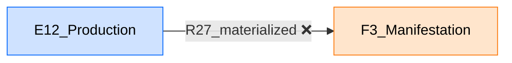

**Proposition (✅) — avec toutes les informations déjà présentes conservées :**
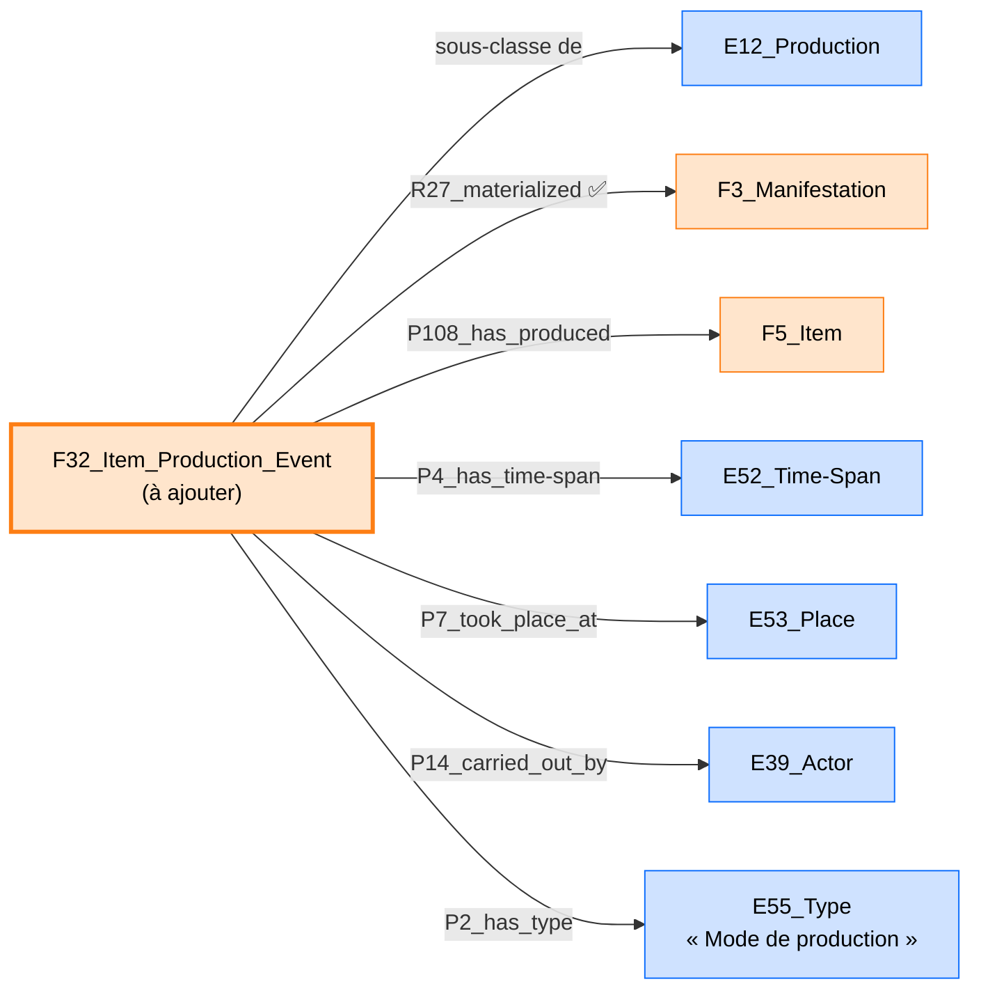
```turtle
:production_manifestation  a lrmoo:F32_Item_Production_Event ;
                            lrmoo:R27_materialized  :manifestation_1830 ;
                            cidoc:P108_has_produced  :item_le_rouge_et_le_noir ;
                            cidoc:P4_has_time-span  :date_1830 ;
                            cidoc:P7_took_place_at  :lieu_paris ;
                            cidoc:P14_carried_out_by  :imprimeur_levasseur ;
                            cidoc:P2_has_type  :valeur_impression .
```

### Implications pour la modélisation
Périmètre : +1 classe (`F32_Item_Production_Event`). Aucune tension — c'est un raffinement, pas une invention, et la preuve ci-dessus garantit qu'aucune information déjà saisie n'est perdue.

---

## Problème 6 — `L61_contains_value_set_of` sur `D1_Digital_Object`, avec la même preuve appliquée

### En une phrase

Même schéma exact que le Problème 5 : le diagramme utilise la case générale « Objet numérique » là où la norme exige sa case fille spécifique, créée pour porter des données de mesure.

### Ce que le graphe affirme
```
D1_Digital_Object --L61_contains_value_set_of--> E54_Dimension
```

### Pourquoi c'est incorrect — avec documentation complète

**`D9_Data_Object`, texte intégral** (`imports/vendor/crmdig-5.0.rdf`) :
> *« This class comprises instances of D1 Digital Object that are the result of measurements or other observations and / or their algorithmic evaluation in the form of structured data, such as encoded formal propositions, CSV files ("comma separated values") or equivalent representations. **If an instance of D1 Digital Object contains the value set of an instance of E54 Dimension, such as the primary data from an instance of S21 Measurement, this association can be documented with the property L61 contains value set of (has value set representation).** »*
> — `rdfs:subClassOf` : `D1_Digital_Object`, `E31_Document`.

Exactement comme pour `F32_Item_Production_Event` au Problème 5 : la norme dit, en toutes lettres, que `D9_Data_Object` a été pensée précisément pour porter `L61_contains_value_set_of`.

### La preuve que rien d'autre n'est perdu

`D9_Data_Object ⊂ D1_Digital_Object ⊂ E73_Information_Object ⊂ E90_Symbolic_Object ⊂ E72_Legal_Object`. Toutes les informations déjà attachées à `D1_Digital_Object` dans notre diagramme restent valables :

| Information déjà présente | Propriété | Exige officiellement | Conservé ? |
|---|---|---|---|
| Format (E55 Type) | `P2_has_type` | `E1_CRM_Entity` (universel) | ✅ |
| Notes (E62 String) | `P3_has_note` | `E1_CRM_Entity` (universel) | ✅ |
| Droits (E30 Right) | `P104_is_subject_to` | `E72_Legal_Object` | `D9 ⊂ D1 ⊂ E73_Information_Object ⊂ E90_Symbolic_Object ⊂ E72_Legal_Object` — ✅ |
| Dimension (E54) | `L61_contains_value_set_of` | `D9_Data_Object` exactement | C'est la raison d'être de `D9` — ✅ |

### A. Changements à faire dans le diagramme visuel

- Sur les pages `D1`, `exemple` (et partout où le patron se répète) : co-typer la case `D1_Digital_Object` qui porte `L61_contains_value_set_of` aussi comme `D9_Data_Object` (une case avec double étiquette, ou une case fille reliée par « sous-classe de », selon la convention déjà utilisée pour `F5_Item`/`E22_Human-Made_Object` au Problème 3).
- Toutes les autres flèches (`P2_has_type`, `P3_has_note`, `P104_is_subject_to`) restent identiques.

### B. Changements à faire dans le RDF

**À ajouter au périmètre :** `D9_Data_Object`.

**Proposition (✅) :**
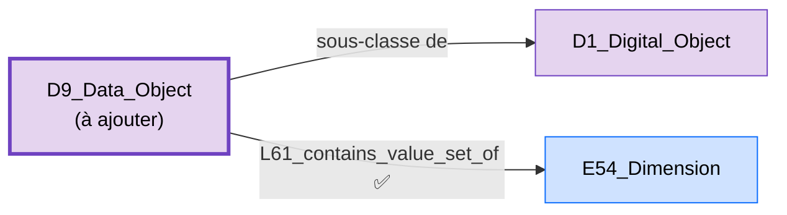
```turtle
:fichier_numerique  a crmdig:D1_Digital_Object, crmdig:D9_Data_Object ;
                     crmdig:L61_contains_value_set_of  :dimension_pixels .
```

### Implications pour la modélisation
Périmètre : +1 classe. **Remarque transversale avec le Problème 5 :** les deux partagent le même schéma — le diagramme emploie systématiquement la classe mère, déjà dans le périmètre, là où le modèle officiel exige une sous-classe précise, absente et créée spécifiquement pour cette flèche. Un seul principe (« compléter le périmètre ») résout les deux, et la même méthode de preuve par la chaîne d'héritage garantit qu'aucune information déjà saisie n'est perdue dans les deux cas.

---

## Découverte complémentaire : la branche « D2-A » (Manifestation vers Digital Object) — corrigée le 6 juillet, une classe à remplacer, pas une branche à supprimer

**⚠ Cette section corrige une conclusion antérieure de ce même document.** La version précédente concluait qu'il fallait supprimer la branche « D2-A » et la remplacer par `P106_is_composed_of`. Une vérification plus poussée du paper source (`Paper_Article_Revue HN_V2.docx.pdf`, version du 6 juillet 2026) montre que ce diagnostic était incomplet : la distinction entre les deux branches était **intentionnelle**, pas une erreur de copier-coller — seule la classe technique utilisée pour l'implémenter était fautive. Voici le raisonnement complet, refait depuis le début.

### Le constat, vérifié caja par caja dans le diagramme

Il existe, sur les pages `model`, `Hiérarchie` et `exemple`, **deux cases distinctes** `D2_Digitization_Process` (vérifié par leur identifiant interne, pas seulement par leur étiquette) :

```
« D2-A » --P16_used_specific_object--> F3_Manifestation   (arête aujourd'hui BRISÉE, sans destination valide)
« D2-B » --L1_digitized--> E18_Physical_Thing (= F5_Item)
```

### Ce que le paper source confirme : cette distinction est voulue, pas accidentelle

Citation intégrale du paper (note de bas de page 15) :
> *« À noter que la différence d'intitulé ("numérisation" pour le D2 Digitization process partant de l'objet physique, "production" pour le D2 Digitization process partant de manifestation) est **volontaire**, et motivée par la différence entre les objets nativement numériques et les objets digitalisés. »*

Et dans le corps du texte :
> *« L'entité « D1_Digital_Object » désigne tout fichier numérique associé à une expression. Celui-ci peut être soit issu de la numérisation d'un objet physique existant, soit créé directement sous forme numérique, sans équivalent matériel préalable. [...] À partir de l'entité « F3_Manifestation », le modèle prévoit ainsi deux voies de concrétisation complémentaires. La première conduit à un objet matériel (« F5_Item ») au moyen d'un événement de production (« E12_Production »). La seconde aboutit à un objet numérique (« D1_Digital_Object »), qu'il soit produit nativement ou issu de la numérisation d'un objet physique. »*

**Conclusion révisée : « D2-A » représente un vrai besoin, voulu par l'équipe — un événement de production numérique native, symétrique à `E12_Production` côté physique. Le problème n'est donc pas l'existence de cette branche, mais le choix de la classe `D2_Digitization_Process` pour la représenter.**

### Pourquoi `D2_Digitization_Process` reste structurellement impossible pour ce cas — documentation complète, inchangée

**`D2_Digitization_Process`, texte intégral** (`imports/vendor/crmdig-5.0.rdf`) :
> *« This class comprises events that result in the creation of instances of D9 Data Object that represent the appearance [...] of **an instance of E18 Physical Thing** such as paper documents, statues, buildings, paintings, biological objects etc. »*

**`L1_digitized`, l'unique propriété officielle pour « ce qui a été numérisé »** :
> *« This property associates an instance of D2 Digitization Process with an instance of E18 Physical Thing which is a material thing. »*
> — `rdfs:domain` : `D2_Digitization_Process` ; **`rdfs:range` : `E18_Physical_Thing`** (jamais `F3_Manifestation`).

**`F3_Manifestation`, le passage qui confirme sa nature abstraite** :
> *« [...] an instance of F3 Manifestation can be regarded as **the prototype for all copies of it**. [...] an instance of F3 Manifestation specifies all of the features or traits that **instances of F5 Item display** in order to be copies of a particular publication. »*

`F3_Manifestation` reste un plan/modèle abstrait — rien ne change à ce constat. Ce qui change, c'est la solution.

### La bonne classe : `D7_Digital_Machine_Event` — la classe générale dont `D2_Digitization_Process` n'est qu'une spécialisation

**Texte intégral** (`imports/vendor/crmdig-5.0.rdf`) :
> *« This class comprises events that happen on physical digital devices following a human activity that intentionally caused its immediate or delayed initiation and **results in the creation of a new instance of D1 Digital Object** on behalf of the human actor. The input of a D7 Digital Machine Event may be parameter settings and/or data to be processed. Some D7 Digital Machine Events may form part of a wider E65 Creation event. »*

**Aucune exigence d'objet physique en entrée** — contrairement à `D2_Digitization_Process`, qui en est une sous-classe spécialisée (vérifié : `D2_Digitization_Process ⊂ D11_Digital_Measurement_Event ⊂ D7_Digital_Machine_Event`).

**Preuve que rien n'est perdu — la même chaîne de preuve que pour `E12_Production` (Problème 5), appliquée ici :**
```
D7_Digital_Machine_Event ⊂ E11_Modification ⊂ E7_Activity                                    (Acteur, P16_used_specific_object)
                         ⊂ E65_Creation ⊂ E63_Beginning_of_Existence ⊂ E5_Event ⊂ E4_Period   (Date, Lieu)
```
Vérifié, texte intégral (`imports/vendor/cidoc-crm-7.1.3.rdf`) : `E65_Creation`, *« This class comprises events that result in the creation of conceptual items or immaterial products, such as legends, poems, texts, music, images, movies, laws, types, etc. »* — `rdfs:subClassOf` : `E7_Activity`, `E63_Beginning_of_Existence`.

C'est très exactement la même paire de branches parentes que celle vérifiée pour `E12_Production` au Problème 5 — la preuve est directement transposable : Date, Acteur et Type restent légaux sans aucun changement.

**Et `L11_had_output` (déjà utilisée dans cette branche du diagramme) a précisément `D7_Digital_Machine_Event` comme domaine officiel** — confirmé dès le premier examen de cette section, mais je ne l'avais pas relié à la bonne classe parente.

### Sur `D1_Digital_Object` contre `D9_Data_Object`

Le paper nomme explicitement ce nœud « D1_Digital_Object » (voir le tableau de métadonnées, relation « Autre objet numérique (D1 Digital object) »). **`D1_Digital_Object` reste donc l'identité principale du nœud.** `D9_Data_Object` (Problème 6) n'intervient que comme **co-typage ponctuel**, exactement pour le besoin technique de `L61_contains_value_set_of` (la Dimension) — de la même façon qu'une Manifestation alternative ou un autre objet physique apparaissent comme des relations possibles, sans redéfinir l'identité principale de l'entité. Les deux classes coexistent sans tension, puisque `D9_Data_Object ⊂ D1_Digital_Object` (déjà vérifié au Problème 6).

### Ce qu'il faut changer — un seul mot à corriger, rien à supprimer

**Retyper la case « D2-A »** : remplacer `D2_Digitization_Process` par `D7_Digital_Machine_Event`. Garder texture, arêtes et voisinage identiques.

### A. Changements à faire dans le diagramme visuel

- Sur les pages `model`, `Hiérarchie`, `exemple` : renommer la case « D2-A » de `D2_Digitization_Process` à `D7_Digital_Machine_Event` — ne rien changer d'autre : les arêtes `P16_used_specific_object` (vers `F3_Manifestation`), `L11_had_output` (vers `D1_Digital_Object`), `P4_has_time-span`, `P14_carried_out_by`, `P2_has_type` restent identiques.
- Réparer, au passage, l'arête `P16_used_specific_object` aujourd'hui brisée (sans destination valide) — elle doit pointer vers la case `F3_Manifestation`.
- Garder « D2-B » (`D2_Digitization_Process`, numérisation réelle depuis `F5_Item`) strictement inchangée — c'est la branche déjà correcte.

### B. Changements à faire dans le RDF

**À ajouter au périmètre :** `D7_Digital_Machine_Event` (une seule classe ; ses propriétés `L11_had_output`, `P16_used_specific_object`, `P4_has_time-span`, `P14_carried_out_by`, `P2_has_type` sont toutes déjà présentes et déjà légales).

**État actuel (❌) :**
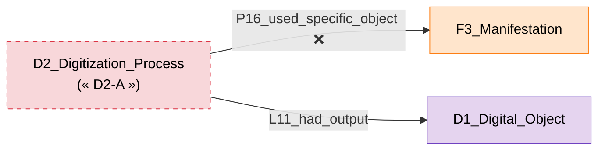

**Proposition (✅) — deux scénarios symétriques, chacun avec sa propre classe correcte :**
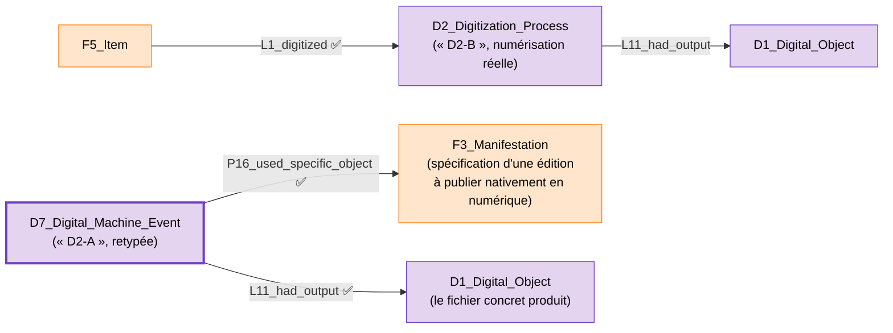

**Point important à ne pas confondre :** `F3_Manifestation` reste ici, comme partout ailleurs dans ce document, le plan/spécification abstraite — jamais un fichier. La distance qui sépare `F3_Manifestation` de `D1_Digital_Object` est **exactement la même distance conceptuelle** que celle qui sépare `F3_Manifestation` de `F5_Item` du côté physique : la Manifestation décrit *ce que l'édition doit être* (contenu, langue, forme prévue) ; `F5_Item`/`D1_Digital_Object` sont chacun *une concrétisation particulière* de ce plan — un exemplaire papier d'un côté, un fichier concret de l'autre. `D7_Digital_Machine_Event` (comme `F32_Item_Production_Event` pour le papier) est l'événement qui relie le plan à sa concrétisation.
```turtle
# Scénario 1 -- numérisation réelle d'un exemplaire physique
:item_le_rouge_et_le_noir  crmdig:L1i_was_digitized_by  :processus_numerisation .
:processus_numerisation    crmdig:L11_had_output  :fichier_numerise .

# Scénario 2 -- production nativement numérique, depuis la Manifestation
:evenement_production_numerique  a crmdig:D7_Digital_Machine_Event ;
                                   cidoc:P16_used_specific_object  :manifestation_numerique_native ;
                                   crmdig:L11_had_output  :fichier_numerique_natif ;
                                   cidoc:P14_carried_out_by  :agent_production ;
                                   cidoc:P4_has_time-span  :date_production .
```

### Implications pour la modélisation
- Périmètre : +1 classe (`D7_Digital_Machine_Event`) — aucune propriété nouvelle, tout le reste est déjà présent et légal.
- Aucune case à supprimer — seule sa classe change, toutes les données déjà saisies sous « D2-A » restent valables une fois la classe corrigée.
- Réparer, au passage, l'arête `P16_used_specific_object` brisée (destination manquante).
- **`D1_Digital_Object` reste l'identité principale du nœud** (conforme au paper), `D9_Data_Object` n'intervenant qu'en co-typage pour la Dimension (Problème 6).
- Vérifier, dans les données déjà chargées (cas Stendhal), sous quelle classe la production numérique éventuelle a été saisie — la retyper si besoin.

### Texte à proposer pour le paper — pour combler un silence, pas corriger une erreur

Le paper ne nomme aujourd'hui aucune classe pour le cas de la production nativement numérique — il décrit l'intention (« qu'il soit produit nativement ») sans la rattacher à un mécanisme technique précis. Voici le texte actuel et la phrase à ajouter, pour que le paper et l'ontologie restent parfaitement alignés.

**Texte actuel du paper** (section 3.2, paragraphe sur `D1_Digital_Object`) :
> *« L'entité « D1_Digital_Object » désigne tout fichier numérique associé à une expression. Celui-ci peut être soit issu de la numérisation d'un objet physique existant, soit créé directement sous forme numérique, sans équivalent matériel préalable. Dans le premier cas, le lien avec l'objet source est documenté par un «D2_Digitization_Process», qui conserve la trace des conditions de numérisation (acteur, date, méthodes et outils employés). »*

**Texte proposé pour remplacer ce paragraphe** (ajout en gras, reste inchangé) :
> *« L'entité « D1_Digital_Object » désigne tout fichier numérique associé à une expression. Celui-ci peut être soit issu de la numérisation d'un objet physique existant, soit créé directement sous forme numérique, sans équivalent matériel préalable. Dans le premier cas, le lien avec l'objet source est documenté par un «D2_Digitization_Process», qui conserve la trace des conditions de numérisation (acteur, date, méthodes et outils employés). **Dans le second cas, où l'objet numérique est produit nativement, sans numérisation d'un support physique préexistant, cette production est documentée par un «D7_Digital_Machine_Event» — la classe CRMdig générale dont «D2_Digitization_Process» constitue une spécialisation, et qui ne présuppose l'existence d'aucun objet physique source.** »*

---

## Problème 7 — « Dimension » : pas un problème de string contre structure, mais une case fantôme et une information manquante

### En une phrase

Contrairement à ce que laissait penser l'intitulé initial de ce point (« texte simple contre structure »), le diagramme a déjà commencé à structurer correctement la dimension — mais avec une case qui ne peut pas exister telle quelle, et sans jamais préciser l'unité de mesure, ce qui rend le nombre inutilisable en pratique.

### L'explication, sans aucun terme technique non expliqué

Dire qu'un livre « mesure 24 » ne veut rien dire — 24 quoi ? Centimètres ? Pouces ? Pages ? Pour qu'un nombre de mesure ait un sens, il faut toujours deux informations : la valeur (24) et l'unité (cm). CIDOC-CRM a une case, `E54_Dimension`, pensée pour porter ces deux informations ensemble, plutôt qu'un simple nombre isolé.

### Ce que le graphe affirme réellement — vérifié sur les 9 pages

```
F5_Item --P43_has_dimension--> E54_Dimension --P90_has_value--> E60_Number
D1_Digital_Object --L61_contains_value_set_of--> E54_Dimension --P90_has_value--> E60_Number
```
Confirmé : 2 cases `E54_Dimension` distinctes (une pour l'exemplaire physique, une pour l'objet numérique), chacune suivant ce même patron, sur les pages `model`, `F5`, `D1`, `exemple`.

**Bonne nouvelle en partant : le diagramme n'utilise pas un simple texte libre — il utilise déjà `E54_Dimension`, la bonne case de départ.** Le problème se situe dans ce qui suit, à deux endroits précis.

### Défaut A — `E60_Number` est traitée comme une case, alors que c'est exactement la même erreur que `E62_String` au Problème 1

**`P90_has_value`, texte officiel complet** (`imports/vendor/cidoc-crm-7.1.3.rdf`) :
> *« This property allows an instance of E54 Dimension to be approximated by an instance of E60 Number primitive. »*
> — `rdfs:domain` : `E54_Dimension` ; **`rdfs:range` : `rdfs:Literal`** — pas une classe avec sa propre URI.

Comme signalé dès le début de ce document : `E60_Number` fait partie des « Primitive Values » que CIDOC-CRM lui-même déclare, dans l'en-tête de sa propre release officielle, comme n'ayant **aucune URI** — toujours réalisées comme `rdfs:Literal`. Une case `E60_Number` dessinée dans le diagramme n'est donc, techniquement, pas différente de la case `E62_String` du Problème 1 : ce n'est pas une classe réelle, seulement une étiquette visuelle qui doit se transformer en simple valeur littérale directement accrochée à `P90_has_value`.

### Défaut B — `P91_has_unit` est totalement absente : l'unité de mesure n'est jamais indiquée

**`P91_has_unit`, texte officiel complet** :
> *« This property shows the type of unit an instance of E54 Dimension was expressed in. »*
> — `rdfs:domain` : `E54_Dimension` ; `rdfs:range` : `E58_Measurement_Unit`.

**`E58_Measurement_Unit`, texte officiel complet** :
> *« This class is a specialization of E55 Type and comprises the types of measurement units: feet, inches, centimetres, litres, lumens, etc. This type is used categorically in the model without reference to instances of it [...] Système International (SI) units or internationally recognized non-SI terms should be used whenever possible, such as those defined by ISO80000:2009. »*

Vérifié sur les 9 pages : **`P91_has_unit` n'apparaît nulle part.** Ce n'est pas un simple détail de style qui manque — c'est une information réellement absente : un nombre de dimension sans unité ne peut être ni comparé, ni réutilisé de façon fiable par personne d'autre que celui qui l'a saisi de mémoire.

### Un bonus découvert dans la même citation officielle, utile pour la suite

La note de balisage d'`E54_Dimension` elle-même précise, texte intégral :
> *« The method of determination should be expressed using the property P2 has type (is type of). Note that simple terms such as "diameter" or "length" are normally insufficient to unambiguously describe a respective dimension. »*

Autrement dit : si un jour on a besoin de distinguer, pour un même livre, la hauteur de la largeur (deux instances distinctes d'`E54_Dimension`), le mécanisme officiellement prévu est — sans surprise — encore `P2_has_type`/`E55_Type`, avec le même besoin d'ancre `P127_has_broader_term` déjà expliqué au Problème 1b, si les deux catégories doivent être distinguées automatiquement.

### Ce qu'il faut changer

Retirer la case `E60_Number` (remplacée par une valeur littérale directe), et ajouter une valeur d'unité via `P91_has_unit`. Rien d'autre ne change — `E54_Dimension` et `P90_has_value` restent tels quels, ils étaient déjà corrects.

### A. Changements à faire dans le diagramme visuel

- Sur les pages `model`, `F5`, `D1`, `exemple` : supprimer la case `E60_Number` ; la flèche `P90_has_value` doit aboutir directement à une valeur écrite (par exemple « 24 »), pas à une case de classe.
- Ajouter, à côté de chaque case `E54_Dimension`, une nouvelle flèche `P91_has_unit (P91i_is_unit_of)` vers une case `E58_Measurement_Unit`, avec sa valeur (par exemple « cm »).

### B. Changements à faire dans le RDF

**À ajouter au périmètre :** `E58_Measurement_Unit`, `P91_has_unit`/`P91i_is_unit_of`. `E54_Dimension` et `P90_has_value` sont déjà présentes et déjà correctes.

**État actuel (❌) :**
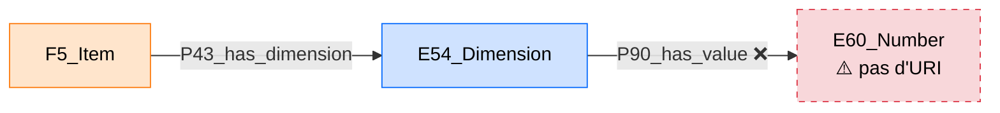

**Proposition (✅) :**
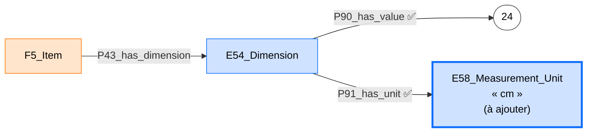
```turtle
:dimension_hauteur  a cidoc:E54_Dimension ;
                     cidoc:P90_has_value  "24"^^xsd:decimal ;
                     cidoc:P91_has_unit   :unite_cm .

:unite_cm  a cidoc:E58_Measurement_Unit ;
           rdfs:label  "centimètre"@fr .

:item_le_rouge_et_le_noir  cidoc:P43_has_dimension  :dimension_hauteur .
```

### Implications pour la modélisation
- Périmètre : +1 classe (`E58_Measurement_Unit`), +2 propriétés (`P91_has_unit`/`P91i_is_unit_of`).
- Aucune tension : `E58_Measurement_Unit` est elle-même une spécialisation d'`E55_Type`, donc parfaitement dans l'esprit du reste du modèle.
- Si le besoin de distinguer plusieurs dimensions (hauteur, largeur, poids) pour un même livre se présente, le même mécanisme `P2_has_type` + `P127_has_broader_term` du Problème 1b s'applique ici aussi — pas de nouveau principe à inventer.
- Vérifier, dans les données déjà chargées (cas Stendhal), si une valeur de dimension existe déjà sans unité — la compléter plutôt que la perdre.

---

## Problème 8 — Précision XSD perdue par rapport à l'original de Mélanie (dates et nombres)

### En une phrase

Quatre propriétés qui, dans le tout premier fichier de Mélanie, enregistraient des dates et des nombres avec un type précis (`xsd:dateTime`, `xsd:integer`), enregistrent aujourd'hui n'importe quel texte sans distinction (`rdfs:Literal`) — ce n'est l'erreur de personne, la reconstruction actuelle a simplement suivi, au mot près, ce que la norme CIDOC-CRM officielle publie elle-même, qui est moins stricte que ce que Mélanie avait ajouté de sa propre initiative.

### L'explication, sans aucun terme technique non expliqué

Quand on enregistre une date dans un ordinateur, il y a deux façons de le faire : soit comme un texte quelconque (« le 1er janvier 1830 », ou « 1830 », ou « vers 1830 » — trois écritures différentes pour la même idée, qu'aucun programme ne peut comparer entre elles automatiquement), soit comme une **date au format reconnu** (`1830-01-01`), que n'importe quel programme sait trier, comparer, ou interroger (« montre-moi tous les livres publiés entre 1820 et 1840 »). La première façon s'appelle, en RDF, `rdfs:Literal` (texte générique) ; la seconde s'appelle `xsd:dateTime` (une date reconnue comme telle). Il en va de même pour les nombres : `rdfs:Literal` accepte n'importe quoi écrit, `xsd:integer` garantit que c'est vraiment un nombre entier.

### Ce qui a été vérifié — comparaison précise entre l'original de Mélanie et l'ontologie actuelle

| Propriété | Rang dans l'original de Mélanie | Rang dans l'ontologie actuelle |
|---|---|---|
| `P82_at_some_time_within` (date maximale d'une période) | `xsd:dateTime` | `rdfs:Literal` |
| `P82a_begin_of_the_begin` (début au plus tôt) | `xsd:dateTime` | `rdfs:Literal` |
| `P82b_end_of_the_end` (fin au plus tard) | `xsd:dateTime` | `rdfs:Literal` |
| `P90_has_value` (valeur numérique d'une dimension) | `xsd:integer` | `rdfs:Literal` |

**Les configurations complètes que Mélanie avait mises en place, texte intégral, telles qu'elles étaient dans le fichier original qu'elle avait livré au projet** :

```xml
<owl:DatatypeProperty rdf:about="http://www.cidoc-crm.org/cidoc-crm/P82_at_some_time_within">
    <rdfs:domain rdf:resource="http://www.cidoc-crm.org/cidoc-crm/E52_Time-Span"/>
    <rdfs:range rdf:resource="http://www.w3.org/2001/XMLSchema#dateTime"/>
    <!-- ... commentaires et labels multilingues, inchangés ... -->
</owl:DatatypeProperty>

<owl:DatatypeProperty rdf:about="http://www.cidoc-crm.org/cidoc-crm/P82a_begin_of_the_begin">
    <rdfs:subPropertyOf rdf:resource="http://www.cidoc-crm.org/cidoc-crm/P82_at_some_time_within"/>
    <rdfs:domain rdf:resource="http://www.cidoc-crm.org/cidoc-crm/E52_Time-Span"/>
    <rdfs:range rdf:resource="http://www.w3.org/2001/XMLSchema#dateTime"/>
    <owl:propertyDisjointWith rdf:resource="http://www.cidoc-crm.org/cidoc-crm/P82b_end_of_the_end"/>
</owl:DatatypeProperty>

<owl:DatatypeProperty rdf:about="http://www.cidoc-crm.org/cidoc-crm/P82b_end_of_the_end">
    <rdfs:subPropertyOf rdf:resource="http://www.cidoc-crm.org/cidoc-crm/P82_at_some_time_within"/>
    <rdfs:domain rdf:resource="http://www.cidoc-crm.org/cidoc-crm/E52_Time-Span"/>
    <rdfs:range rdf:resource="http://www.w3.org/2001/XMLSchema#dateTime"/>
</owl:DatatypeProperty>

<owl:DatatypeProperty rdf:about="http://www.cidoc-crm.org/cidoc-crm/P90_has_value">
    <rdfs:range rdf:resource="http://www.w3.org/2001/XMLSchema#integer"/>
</owl:DatatypeProperty>
```

**Une seconde perte, plus discrète, découverte en documentant celle-ci :** Mélanie avait aussi ajouté `owl:propertyDisjointWith` entre `P82a_begin_of_the_begin` et `P82b_end_of_the_end` — un axiome logique qui dit : « le début-au-plus-tôt et la fin-au-plus-tard d'une même période ne peuvent jamais être la même paire de valeurs ». Vérifié : cet axiome **a aussi disparu** dans l'ontologie actuelle, et — comme pour le type XSD — il n'était déjà pas présent non plus dans la publication officielle du CIDOC-CRM. C'était un ajout personnel de Mélanie, allant plus loin que la norme officielle elle-même.

### Pourquoi ce n'est la faute de personne — avec la preuve

Vérifié directement dans la publication officielle (`imports/vendor/cidoc-crm-7.1.3.rdf`) :
```xml
<rdf:Property rdf:about="P82_at_some_time_within">
  <rdfs:domain rdf:resource="E52_Time-Span" />
  <rdfs:range rdf:resource="http://www.w3.org/2000/01/rdf-schema#Literal" />
</rdf:Property>
```
**La norme officielle elle-même déclare `rdfs:Literal`, pas `xsd:dateTime`.** La reconstruction actuelle de CAO_CRM a suivi cette publication officielle au mot près — un choix parfaitement défendable, aligné sur le même principe de composition pure appliqué ailleurs dans ce document : *« ne pas utiliser un type XSD spécifique [...] pour ne pas introduire un parti pris de modélisation que le CIDOC-CRM lui-même évite »*. Mélanie, de son côté, avait ajouté cette précision par elle-même, au-delà de ce que la norme exige — un choix tout aussi défendable, et clairement plus pratique à l'usage.

### Ce qu'il faut changer — et pourquoi c'est sans risque

Ajouter, en plus du `rdfs:Literal` déjà déclaré (sans le retirer), le type XSD précis sur chacune des 4 propriétés, et restaurer l'axiome `owl:propertyDisjointWith`. **Ceci ne crée aucun conflit avec les principes de prudence suivis ailleurs dans ce document** (éviter d'empiler plusieurs `rdfs:domain`/`rdfs:range` qui s'intersectent et peuvent bloquer les données) : `xsd:dateTime` et `xsd:integer` sont, en RDF, des cas particuliers de `rdfs:Literal` — toute donnée typée reste, au fond, un littéral. Ajouter la précision ne retire aucune permission déjà accordée, elle ne fait que la resserrer pour ces 4 propriétés précises.

### A. Changements à faire dans le diagramme visuel

Rien à changer dans le diagramme lui-même — ce point concerne uniquement le fichier `.rdf`, pas les cases ni les flèches du diagramme draw.io. Si des exemples de valeurs concrètes apparaissent dans le diagramme (comme sur la page `exemple`), s'assurer qu'ils soient écrits dans un format de date/nombre reconnu (`AAAA-MM-JJ`), pour que la donnée réelle corresponde bien au type XSD une fois saisie.

### B. Changements à faire dans le RDF

**Aucun ajout de périmètre** — ces 4 propriétés sont déjà présentes ; il s'agit seulement d'ajouter une seconde déclaration de rang, plus précise, à côté de celle déjà là.

```xml
<rdf:Description rdf:about="http://www.cidoc-crm.org/cidoc-crm/P82_at_some_time_within">
    <rdfs:range rdf:resource="http://www.w3.org/2000/01/rdf-schema#Literal"/>
    <rdfs:range rdf:resource="http://www.w3.org/2001/XMLSchema#dateTime"/>
</rdf:Description>

<rdf:Description rdf:about="http://www.cidoc-crm.org/cidoc-crm/P82a_begin_of_the_begin">
    <rdfs:range rdf:resource="http://www.w3.org/2000/01/rdf-schema#Literal"/>
    <rdfs:range rdf:resource="http://www.w3.org/2001/XMLSchema#dateTime"/>
    <owl:propertyDisjointWith rdf:resource="http://www.cidoc-crm.org/cidoc-crm/P82b_end_of_the_end"/>
</rdf:Description>

<rdf:Description rdf:about="http://www.cidoc-crm.org/cidoc-crm/P82b_end_of_the_end">
    <rdfs:range rdf:resource="http://www.w3.org/2000/01/rdf-schema#Literal"/>
    <rdfs:range rdf:resource="http://www.w3.org/2001/XMLSchema#dateTime"/>
</rdf:Description>

<rdf:Description rdf:about="http://www.cidoc-crm.org/cidoc-crm/P90_has_value">
    <rdfs:range rdf:resource="http://www.w3.org/2000/01/rdf-schema#Literal"/>
    <rdfs:range rdf:resource="http://www.w3.org/2001/XMLSchema#integer"/>
</rdf:Description>
```

**État actuel (❌ — imprécis, mais pas illégal) :**
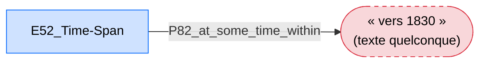

**Proposition (✅) :**
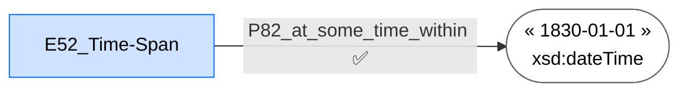
```turtle
:periode_production  cidoc:P82_at_some_time_within  "1830-01-01T00:00:00"^^xsd:dateTime .
```

### Implications pour la modélisation
- Aucun ajout de périmètre, aucune classe ni propriété nouvelle — seulement une précision supplémentaire sur 4 propriétés déjà présentes.
- Restaure deux choses que Mélanie avait pensées et documentées dès le premier fichier, perdues sans intention lors de la reconstruction : le typage XSD, et l'axiome `owl:propertyDisjointWith`.
- Aucune tension avec la prudence méthodologique de ce document : ajouter un rang XSD en plus de `rdfs:Literal` ne crée pas de conflit d'intersection, contrairement à empiler deux classes incompatibles comme domaine/rang.
- Vérifier, dans les données déjà chargées (cas Stendhal), que les valeurs de date et de nombre sont bien écrites dans un format reconnu par `xsd:dateTime`/`xsd:integer` — sinon, les corriger au moment de l'ajout du type.

---

## Synthèse : ce qui reste réellement à décider

| # | Nécessite une décision d'équipe ? | Laquelle |
|---|---|---|
| 1 (Description) | Non | Déjà résolu, rien à décider — garder `P3_has_note`, retirer les deux autres arêtes |
| 1 (Système d'écriture) / 1b | **Décidé (6 juillet 2026)** | Retirer `P3_has_note` de ce côté-ci ; déplacer vers `F2_Expression` (pas `F5_Item`/`D1_Digital_Object`, voir mise à jour du Problème 1) ; accepter l'ajout de `P127_has_broader_term` + le nouveau fichier d'ancres ; correction du tableau du paper requise |
| 2 | **Décidé (6 juillet 2026)** | On respecte LRMoo : ajout d'`E33_Linguistic_Object`/`P72_has_language`, langue retirée de `F3_Manifestation` et déplacée vers `F2_Expression` ; double-appartenance `F2_Expression`/`E33_Linguistic_Object` ; correction du tableau de métadonnées du paper requise (ajout d'une ligne « Expression ») |
| 3 | Oui | Résolu : retirer le lieu d'`E3_Condition_State`, co-typer `F5_Item` comme `E22_Human-Made_Object`, et ajouter `P54`/`P55_has_current_location` pour la vraie localisation manquante des exemplaires |
| 4 | Oui | Retirer les 3 relations directes illégales, confirmer que les chemins déjà légaux (`R3_is_realised_in`, `P16_used_specific_object`, `L11_had_output`) suffisent pour les données réelles |
| 5 | Oui | Accepter l'ajout de `F32_Item_Production_Event` (preuve fournie : aucune information déjà saisie n'est perdue) |
| 6 | Oui | Accepter l'ajout de `D9_Data_Object` (même preuve appliquée) |
| *(complément)* | Oui | Retyper la case « D2-A » de `D2_Digitization_Process` à `D7_Digital_Machine_Event` (garder la structure), réparer l'arête brisée, et ajouter la phrase correspondante au paper |
| 7 | Oui | Retirer `E60_Number` comme case, connecter la valeur en littéral direct, ajouter `E58_Measurement_Unit`/`P91_has_unit` pour l'unité manquante |
| 8 | Oui | Ajouter `xsd:dateTime`/`xsd:integer` en plus de `rdfs:Literal` (sans risque de conflit) et restaurer `owl:propertyDisjointWith` entre `P82a`/`P82b` |
